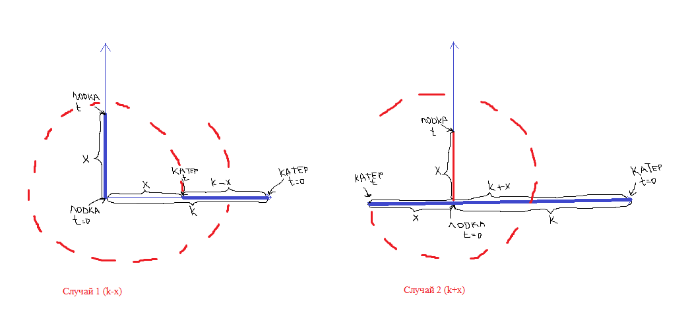
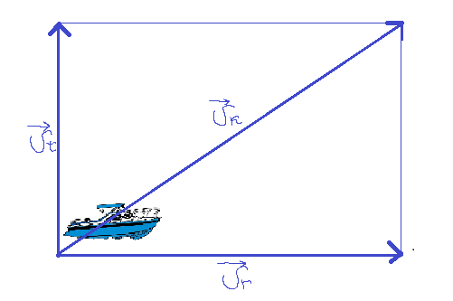
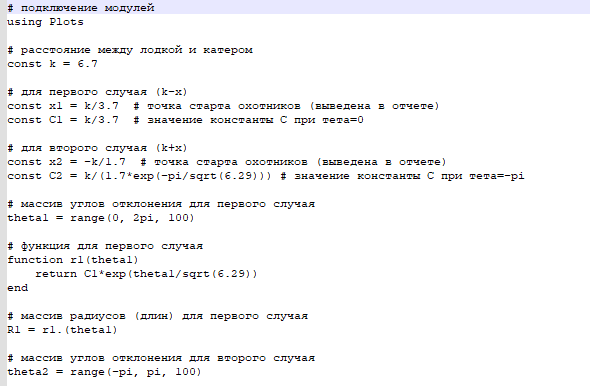
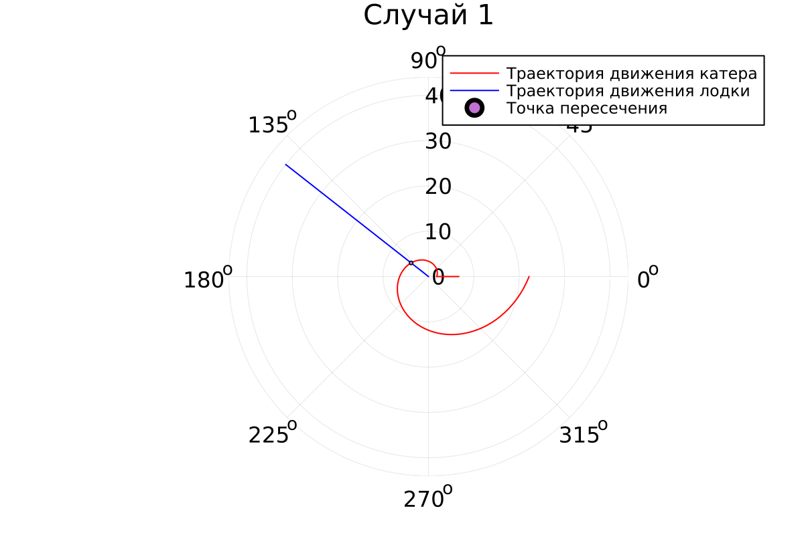
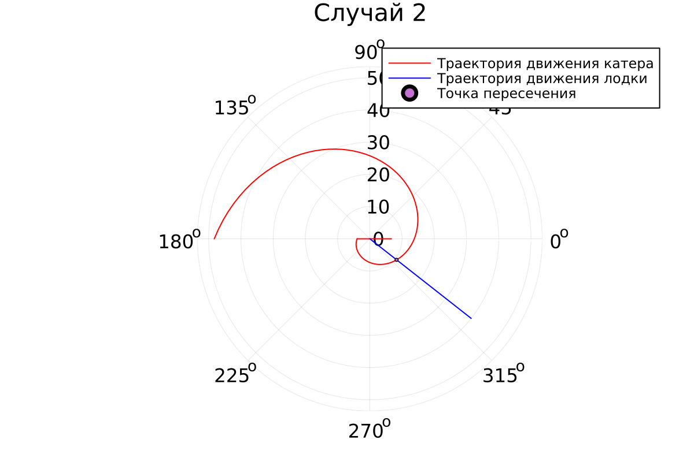

---
## Front matter
lang: ru-RU
title: Лабораторная работа №2
subtitle: Задача о погоне
author:
  - Афтаева К.В.
institute:
  - Российский университет дружбы народов, Москва, Россия
date: 18 февраля 2023

## i18n babel
babel-lang: russian
babel-otherlangs: english

## Formatting pdf
toc: false
toc-title: Содержание
slide_level: 2
aspectratio: 169
section-titles: true
theme: metropolis
header-includes:
 - \metroset{progressbar=frametitle,sectionpage=progressbar,numbering=fraction}
 - '\makeatletter'
 - '\beamer@ignorenonframefalse'
 - '\makeatother'
---

# Информация

## Докладчик

:::::::::::::: {.columns align=center}
::: {.column width="70%"}

  * Афтаева Ксения Васильевна
  * студент группы НПИбд-01-20
  * Российский университет дружбы народов
  * [1032201739@pfur.ru](mailto:1032201739@pfur.ru)
  * <https:https://github.com/KVAftaeva>

:::
::: {.column width="30%"}

:::
::::::::::::::

# Вводная часть

## Актуальность

- Необходим навык математического моделирования, которое является еизбежной составляющей научно-технического прогресса

## Объект и предмет исследования

- Задача о погоне
- Julia
- OpenModelica

## Цели и задачи

- Рассмотреть один из примеров (задача о погоне) построения математических моделей для
выбора правильной стратегии при решении задач поиска
- Выполнить задание согласно варианту: провести анализ и вывод дифференциальных уравнений, смоделировать ситуацию

## Материалы и методы

- Julia
- OpenModelica

# Выполнение работы

## Изучение условия

Мой вариант - **9**: 

На море в тумане катер береговой охраны преследует лодку браконьеров.
Через определенный промежуток времени туман рассеивается, и лодка
обнаруживается на расстоянии **6,7** км от катера. Затем лодка снова скрывается в
тумане и уходит прямолинейно в неизвестном направлении. Известно, что скорость
катера в **2,7** раза больше скорости браконьерской лодки.

## Изучение теоретической части: разбор случаев

Зная соотношение скоростей и то, что время одно и то же, можем составить уравнение для первого и второго случая: $\dfrac{x}V_л = \dfrac{6,7 \pm x}{2,7V_л}$ 

   Отсюда выражаем $x$: $x_1=\dfrac{6,7}{3,7}$, $x_2=\dfrac{6,7}{1,7}$. 

{width=70%}

## Изучение теоретической части: разложение скорости

Нам нужно, чтобы радиальная скорость была равна скорости лодки, поэтому полагаем $V_л=\dfrac{dr}{dt}$. Исходя из рисунка, теоремы Пифагора и известных значений, $V_t=\sqrt{(V_к)^2-(V_r)^2}=\sqrt{(2,7V_л)^2-V_л^2}=\sqrt{6,29}V_л$

{width=70%}

## Вывод дифференциальных уравнений

Получаем два дифференциальных уравнения: $V_л=\dfrac{dr}{dt}$ и $\sqrt{6,29}V_л=r\dfrac{d\theta}{dt}$. Выразим из обоих $dt$: $dt=\dfrac{dr}{V_л}=r\dfrac{d\theta}{\sqrt{6,29}V_л}$. Сократим обе части на скорость лодки и разделим обе части на $r$. Получим $\dfrac{dr}r=\dfrac{d\theta}{\sqrt{6,29}}$. Решив данное уравнение получаем $r(\theta) = C*e^\dfrac{\theta}{\sqrt{6,29}}$. Подставив начальные значения получаем $r(\theta) = \dfrac{6,7}{3,7}*e^\dfrac{\theta}{\sqrt{6,29}}$ (первый случай) и $C = \dfrac{6,7}{1,7e^\dfrac{-\pi}{\sqrt{6,29}}}$ (второй случай)

## Написание кода на Julia

Фрагмент кода:

{width=70%}

## График для первого случая
Точка пересечения: r = 4.9, $\theta$ = 2.5

{width=70%}

## График для второго случая

Точка пересечения: r = 10.6, $\theta$ = -0.7

{width=70%}

# Результаты

## Результат

- Записаны уравнения, описывающие движение катера, с начальными
условиями для двух случаев (в зависимости от расположения катера
относительно лодки в начальный момент времени)
- Построены траектории движения катера и лодки для двух случаев
- Найдены точки пересечения траектории катера и лодки для двух случаев

# Вывод

## Вывод

Я рассмотрела один из примеров (задача о погоне) построения математических моделей для
выбора правильной стратегии при решении задач поиска. Выполнила задание согласно варианту: провела анализ и вывод дифференциальных уравнений, смоделировала ситуацию, построила траекторию движения катера и лодки для двух случаев, нашла точку пересечения траектории катера и лодки.