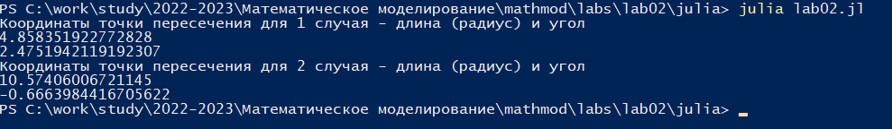

---
## Front matter
title: "Отчет по лабораторной работе №2"
subtitle: "Дисциплина: Математическое моделирование"
author: "Выполнила: Афтаева Ксения Васильевна"

## Generic otions
lang: ru-RU
toc-title: "Содержание"

## Bibliography
bibliography: bib/cite.bib
csl: pandoc/csl/gost-r-7-0-5-2008-numeric.csl

## Pdf output format
toc: true # Table of contents
toc-depth: 2
lof: true # List of figures
lot: true # List of tables
fontsize: 12pt
linestretch: 1.5
papersize: a4
documentclass: scrreprt
## I18n polyglossia
polyglossia-lang:
  name: russian
  options:
	- spelling=modern
	- babelshorthands=true
polyglossia-otherlangs:
  name: english
## I18n babel
babel-lang: russian
babel-otherlangs: english
## Fonts
mainfont: PT Serif
romanfont: PT Serif
sansfont: PT Sans
monofont: PT Mono
mainfontoptions: Ligatures=TeX
romanfontoptions: Ligatures=TeX
sansfontoptions: Ligatures=TeX,Scale=MatchLowercase
monofontoptions: Scale=MatchLowercase,Scale=0.9
## Biblatex
biblatex: true
biblio-style: "gost-numeric"
biblatexoptions:
  - parentracker=true
  - backend=biber
  - hyperref=auto
  - language=auto
  - autolang=other*
  - citestyle=gost-numeric
## Pandoc-crossref LaTeX customization
figureTitle: "Рис."
tableTitle: "Таблица"
listingTitle: "Листинг"
lofTitle: "Список иллюстраций"
lotTitle: "Список таблиц"
lolTitle: "Листинги"
## Misc options
indent: true
header-includes:
  - \usepackage{indentfirst}
  - \usepackage{float} # keep figures where there are in the text
  - \floatplacement{figure}{H} # keep figures where there are in the text
---

# Цель работы

Рассмотреть один из примеров (задача о погоне) построения математических моделей для
выбора правильной стратегии при решении задач поиска. Выполнить задание согласно варианту: провести анализ и вывод дифференциальных уравнений, смоделировать ситуацию.


# Задание

На море в тумане катер береговой охраны преследует лодку браконьеров.
Через определенный промежуток времени туман рассеивается, и лодка
обнаруживается на расстоянии 6,7 км от катера. Затем лодка снова скрывается в
тумане и уходит прямолинейно в неизвестном направлении. Известно, что скорость
катера в 2,7 раза больше скорости браконьерской лодки.
1. Записать уравнение, описывающее движение катера, с начальными
условиями для двух случаев (в зависимости от расположения катера
относительно лодки в начальный момент времени).
2. Построить траекторию движения катера и лодки для двух случаев.
3. Найти точку пересечения траектории катера и лодки.


# Теоретическое введение

**Моделирование** — это особый метод познания окружающего мира, который относится к общенаучным методам. Он может применяться как на эмпирическом, так и на теоретическом
уровнях. В английском языке для понятия моделирования существует два термина: modeling и simulation. Первый означает
моделирование, основанное главным образом на теоретических положениях, а второй — воспроизведение, имитацию состояния системы на основе анализа ее поведения (имитационное моделирование) [@key-1].

**Математической моделью** называется совокупность уравнений или других математических соотношений, отражающих
основные свойства изучаемого объекта или явления в рамках
принятой умозрительной физической модели и особенности
его взаимодействия с окружающей средой на пространственно-временных границах области его локализации. Математические модели различных процессов в континуальных системах строятся, как правило, на языке дифференциальных уравнений, позволяющих наиболее точно описать состояние
процесса в любой точке пространства в произвольный момент
времени. Основными свойствами математических моделей являются адекватность и простота, указывающие на степень соответствия модели изучаемому объекту и возможности ее реализации. Процесс формулировки математической модели yазывается постановкой задачи [@key-2].


# Выполнение лабораторной работы

1. Для выполнения нам потребовалось установить **Julia** и **OpenModelica**. Установка была произведена через менеджер пакетов **choco** с помощью команд `choco install julia` и `choco install openmodelica` соответственно. Кроме того, я расчитала вариант задания, который мне нужно выполнить. У меня вариант 9.
2. Приведем рассуждения, необходимые для вывода уравнения, описывающего движение катера. 

   По условию у нас есть катер береговой охраны (преследователь) и лодка браконьеров (преследуемый). Катер должен поймать лодку, оказавшись физически с ней в одной точке (столкнувшись). Сначала катер обнаруживает лодку на расстоянии $k$ (в моем варианте - 6,7 км). Затем лодка пропадает в тумане (становится невидимой) и начинает прямолинейное движение в неизвестном для катера направлении со скоростью $V_л$. Катер начинает догонять лодку двигаясь со скоростью $V_к = 2,7V_л$. 
   
   При этом катер должен постоянно находиться на том же расстоянии от точки старта лодки (полюс полярной системы координат - $\theta = 0$), что и сама лодка, иначе он может обогнать или отстать от нее. Поэтому катер не может сразу начать движение по спирали. Перед этим ему необходимо двигаться прямолинейно по направлению к полюсу (точке старта лодки) до тех пор, пока он не окажется на том же расстоянии от полюса, что и лодка. После этого катер береговой охраны должен двигаться вокруг полюса удаляясь от него с той же скоростью, что и лодка браконьеров.

   В данной задаче при движении катера прямолинейно возможны два случая:
   - катер проходит расстояние $k-x$ 
   - катер проходит расстояние $k+x$ 
   
   Эти случаи отличаются тем, с какой стороны от полюса начнет движение по спирали катер (рис. @fig:001).

   {#fig:001 width=70%}

   Чтобы найти расстояние $x$ (расстояние от полюса, после достижения которого катер начнет движение по спирали), нужно составить уравнение. Пусть через время $t$ катер и лодка окажутся на одном расстоянии $x$ от полюса. За это время лодка пройдет $x$, а катер $k-x$ или $k+x$ (в зависимости от начального положения катера относительно полюса). Тогда время, за которое они пройдут это расстояние, вычисляется как $\dfrac{x}{V_л}$ или $\dfrac{k-x}{V_к}$ (во втором случае $\dfrac{k+x}{V_к}$. Зная соотношение скоростей и то, что время одно и то же, можем составить уравнение для первого и второго случая: $\dfrac{x}V_л = \dfrac{6,7 \pm x}{2,7V_л}$ 

   Отсюда выражаем $x$: $x_1=\dfrac{6,7}{3,7}$, $x_2=\dfrac{6,7}{1,7}$. Задачу будем решать для двух случаев.

   Как мы уже описали выше, после того, как катер береговой охраны окажется на одном расстоянии от полюса, что и лодка, он должен сменить прямолинейную траекторию и начать двигаться вокруг полюса удаляясь от него со скоростью лодки $V_л$. Для этого скорость катера раскладываем на две составляющие: $V_r$  - радиальная скорость, $V_t$ - тангенциальная скорость (рис. @fig:002). Радиальная скорость - это скорость, с которой катер удаляется от полюса: $V_r=\dfrac{dr}{dt}$. Нам нужно, чтобы эта скорость была равна скорости лодки, поэтому полагаем $V_л=\dfrac{dr}{dt}$. Тангенциальная скорость – это линейная скорость вращения катера относительно полюса. Она равна произведению угловой скорости на радиус: $V_t=r\dfrac{d\theta}{dt}$. 

   {#fig:002 width=70%}

   Исходя из рисунка (рис. @fig:002), теоремы Пифагора и известных значений, $V_t=\sqrt{(V_к)^2-(V_r)^2}=\sqrt{(2,7V_л)^2-V_л^2}=\sqrt{6,29}V_л$

   Таким образом мы получаем два дифференциальных уравнения: $V_л=\dfrac{dr}{dt}$ и $\sqrt{6,29}V_л=r\dfrac{d\theta}{dt}$. Выразим из обоих $dt$: $dt=\dfrac{dr}{V_л}=r\dfrac{d\theta}{\sqrt{6,29}V_л}$. Сократим обе части на скорость лодки и разделим обе части на $r$. Получим $\dfrac{dr}r=\dfrac{d\theta}{\sqrt{6,29}}$. 

   Решив данное уравнение (рис. @fig:003) получаем $r(\theta) = C*e^\dfrac{\theta}{\sqrt{6,29}}$.


   {#fig:003 width=70%}

   В начальный момент ($\theta=0$) $r_0 = C$, при этом $r_0=x_1$. Поставляя значения получаем формулe: $r(\theta) = \dfrac{6,7}{3,7}*e^\dfrac{\theta}{\sqrt{6,29}}$ (первый случай). Для второго случая ($\theta=-\pi$, $r_0=x_2$) $r(\theta) = C*e^\dfrac{-\pi}{\sqrt{6,29}}=r_0$. Следовательно $C*e^\dfrac{-\pi}{\sqrt{6,29}}=\dfrac{6,7}{1,7}$. Получаем, что $C = \dfrac{6,7}{1,7e^\dfrac{-\pi}{\sqrt{6,29}}}$

3. Написала код на Julia:
```
# подключение модулей
using Plots

# расстояние между лодкой и катером
const k = 6.7

# для первого случая (k-x)
const x1 = k/3.7  # точка старта охотников (выведена в отчете)
const C1 = k/3.7  # значение константы С при тета=0

# для второго случая (k+x)
const x2 = -k/1.7  # точка старта охотников (выведена в отчете)
const C2 = k/(1.7*exp(-pi/sqrt(6.29))) # значение константы С при тета=-pi

# массив углов отклонения для первого случая 
theta1 = range(0, 2pi, 100)

# функция для первого случая
function r1(theta1)
	return C1*exp(theta1/sqrt(6.29))
end

# массив радиусов (длин) для первого случая
R1 = r1.(theta1)

# массив углов отклонения для второго случая 
theta2 = range(-pi, pi, 100)

# функция для второго случая
function r2(theta2)
	return C2*exp(theta2/sqrt(6.29))
end

# массив радиусов (длин) для второго случая
R2 = r2.(theta2)

#вывод координат на экран
println("Координаты точки пересечения для 1 случая - длина (радиус) и угол")
println(R1[40])
println(theta1[40])
println("Координаты точки пересечения для 2 случая - длина (радиус) и угол")
println(R2[40])
println(theta2[40])

# График для первого случая
plt1 = plot(
	proj = :polar,
	aspect_ratio=:equal,
	dpi=200,
	title="Случай 1",
	legend=true)
	
plot!(
	plt1,
	theta1,
	R1,
	xlabel="theta",
	ylabel="r(theta)",
	label="Траектория движения катера",
	color=:red)
	
plot!(
	plt1,
	[0.0,0.0],
	[x1,6.7],	
	color=:red,
	label="")
	
plot!(
	plt1,
	[0.0,theta1[40]],
	[0,40],
	xlabel="theta",
	ylabel="r(theta)",
	label="Траектория движения лодки",
	color=:blue)
	
scatter!(
	plt1,
	[theta1[40]],
	[R1[40]],
	label="Точка пересечения",
	ms=1.5)
	
savefig(plt1,"First.png")

# График для второго случая
plt2 = plot(
	proj = :polar,
	aspect_ratio=:equal,
	dpi=200,
	title="Случай 2",
	legend=true)
	
plot!(
	plt2,
	theta2,
	R2,
	xlabel="theta",
	ylabel="r(theta)",
	label="Траектория движения катера",
	color=:red)
	
plot!(
	plt2,
	[0.0,0.0],
	[x2,6.7],	
	color=:red,
	label="")
	
plot!(
	plt2,
	[0.0,theta2[40]],
	[0,40],
	xlabel="theta",
	ylabel="r(theta)",
	label="Траектория движения лодки",
	color=:blue)
	
scatter!(
	plt2,
	[theta2[40]],
	[R2[40]],
	label="Точка пересечения",
	ms=1.5)
	
savefig(plt2,"Second.png")
```
4. В папке, где лежит файл с кодом, запустила **PowerShell** и ввела `julia lab02.jl` (рис. @fig:004) для запуска скрипта (lab02.jl - название файла с кодом). В консоли вывелись точки пересечения для первого и второго случая (рис. @fig:004). В папке появились изображения с графиками для первого (рис. @fig:005) и второго случаев (рис. @fig:006).

{#fig:004 width=70%}

{#fig:005 width=70%}

{#fig:006 width=70%}

5. Для данной задачи нельзя построить решение с помощью базовых стредств OpenModelica, поэтому работу с ней мы пропускаем в данной лабораторной.

# Выводы

Я рассмотрела один из примеров (задача о погоне) построения математических моделей для
выбора правильной стратегии при решении задач поиска. Выполнила задание согласно варианту: провела анализ и вывод дифференциальных уравнений, смоделировала ситуацию, построила траекторию движения катера и лодки для двух случаев, нашла точку пересечения траектории катера и лодки.

# Список литературы{.unnumbered}

::: {#refs}
:::
