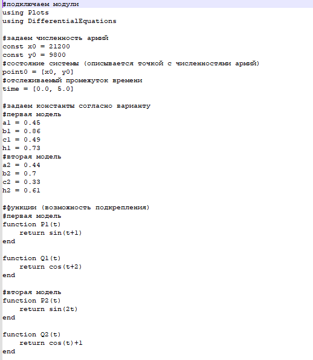

---
## Front matter
lang: ru-RU
title: Лабораторная работа №3
subtitle: Модель боевых действий
author:
  - Афтаева К.В.
institute:
  - Российский университет дружбы народов, Москва, Россия
date: 25 февраля 2023

## i18n babel
babel-lang: russian
babel-otherlangs: english

## Formatting pdf
toc: false
toc-title: Содержание
slide_level: 2
aspectratio: 169
section-titles: true
theme: metropolis
header-includes:
 - \metroset{progressbar=frametitle,sectionpage=progressbar,numbering=fraction}
 - '\makeatletter'
 - '\beamer@ignorenonframefalse'
 - '\makeatother'
---

# Информация

## Докладчик

:::::::::::::: {.columns align=center}
::: {.column width="70%"}

  * Афтаева Ксения Васильевна
  * студент группы НПИбд-01-20
  * Российский университет дружбы народов
  * [1032201739@pfur.ru](mailto:1032201739@pfur.ru)
  * <https:https://github.com/KVAftaeva>

:::
::: {.column width="30%"}

:::
::::::::::::::

# Вводная часть

## Актуальность

- Необходим навык математического моделирования, которое является еизбежной составляющей научно-технического прогресса

## Объект и предмет исследования

- Модель боевых действий
- Julia
- OpenModelica

## Цели и задачи

Рассмотреть некоторые простейшие модели боевых действий – модели
Ланчестера. Выполнить задание согласно варианту: построить графики изменения численности войск армии Х и армии У для
двух случаев:
1. Модель боевых действий между регулярными войсками
 $$\begin{cases}\frac{dx}{dt}=-0.45x(t)-0.86y(t)+\sin(t+1)\\\frac{dy}{dt}=-0.49x(t)-0.73y(t)+\cos(t+2)\end{cases}$$ 
2. Модель ведение боевых действий с участием регулярных войск и
партизанских отрядов 
$$\begin{cases}\frac{dx}{dt}=-0.44x(t)-0.7y(t)+\sin(2t)\\\frac{dy}{dt}=-0.33x(t)y(t)-0.61y(t)+\cos(t)+1\end{cases}$$

## Материалы и методы

- Julia
- OpenModelica

# Выполнение работы

## Изучение теории

Мой вариант - **10**: 

Между страной Х и страной У идет война. Численность состава войск
исчисляется от начала войны, и являются временными функциями
$x(t)$ и $y(t)$. В
начальный момент времени страна **Х** имеет армию численностью **21 200** человек, а в распоряжении страны **Y** армия численностью в **9 800** человек. Для упрощения модели считаем, что коэффициенты a, b, c, h постоянны. Также считаем $P(t)$ и $Q(t)$ - непрерывные функции.

## Модель боевых действий между регулярными войсками

$$\begin{cases}\frac{dx}{dt}=-a(t)x(t)-b(t)y(t)+P(t)\\\frac{dy}{dt}=-c(t)x(t)-h(t)y(t)+Q(t)\end{cases}$$ 
Cостояние системы описывается точкой $(x,y)$. Тогда модель принимает вид:

  $$\begin{cases}\dot{x}=-by\\\dot{y}=-cx\end{cases}$$ 
   Это жесткая модель, которая допускает точное решение: 

   $$\begin{cases}\frac{dx}{dy}=\frac{by}{cx}\end{cases}$$ 

  Продлелав нетрудные преобразования, получим $cx^2-by^2=C$.

## Модель боевых действий с участием регулярных войск и партизанских отрядов

$$\begin{cases}\frac{dx}{dt}=-by(t)\\\frac{dy}{dt}=-cx(t)y(t)\end{cases}$$ 

   Эта система приводится к уравнению 

   $$\frac{d}{dt}\left(\frac{b}{2}x^{2}(t)-cy(t)\right)=0$$

   которое при заданных начальных условиях имеет единственное решение:

   $$\frac{b}{2}x^{2}(t)-cy(t)=\frac{b}{2}x^{2}(0)-cy(0)=C_{1}$$ 

## Траектории для двух моделей войны

:::::::::::::: {.columns align=center}
::: {.column width="50%"}

:::
::: {.column width="50%"}

:::
::::::::::::::

## Написание кода на Julia

Фрагмент кода:

:::::::::::::: {.columns align=center}
::: {.column width="50%"}

:::
::: {.column width="50%"}

:::
::::::::::::::

## Написание кода на OpenModelica

Коды для двух случаев:

:::::::::::::: {.columns align=center}
::: {.column width="50%"}

:::
::: {.column width="50%"}

:::
::::::::::::::

## Графики полученные из Julia

:::::::::::::: {.columns align=center}
::: {.column width="50%"}

:::
::: {.column width="50%"}

:::
::::::::::::::

## Графики полученные из OpenModelica

:::::::::::::: {.columns align=center}
::: {.column width="50%"}

:::
::: {.column width="50%"}

:::
::::::::::::::

# Результаты

## Результат

Построены графики изменения численности войск армии Х и армии У для
двух случаев:
1. Модель боевых действий между регулярными войсками
 $$\begin{cases}\frac{dx}{dt}=-0.45x(t)-0.86y(t)+\sin(t+1)\\\frac{dy}{dt}=-0.49x(t)-0.73y(t)+\cos(t+2)\end{cases}$$ 
2. Модель ведение боевых действий с участием регулярных войск и
партизанских отрядов 
$$\begin{cases}\frac{dx}{dt}=-0.44x(t)-0.7y(t)+\sin(2t)\\\frac{dy}{dt}=-0.33x(t)y(t)-0.61y(t)+\cos(t)+1\end{cases}$$

Победу в обоих случаях одерживает страна Х.

# Вывод

## Вывод

Я рассмотрела некоторые простейшие модели боевых действий – модели
Ланчестера. Выполнила задание согласно варианту: построила графики изменения численности войск армии Х и армии У для
двух случаев, определила победителей.