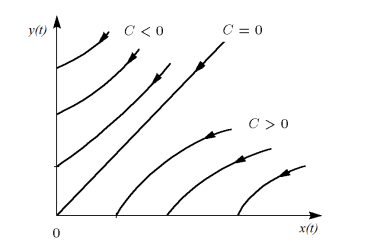
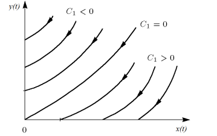
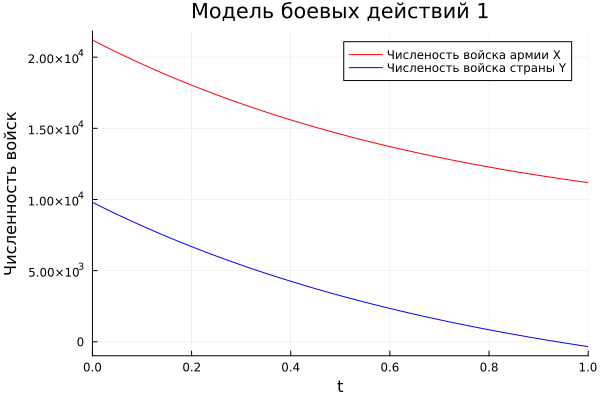
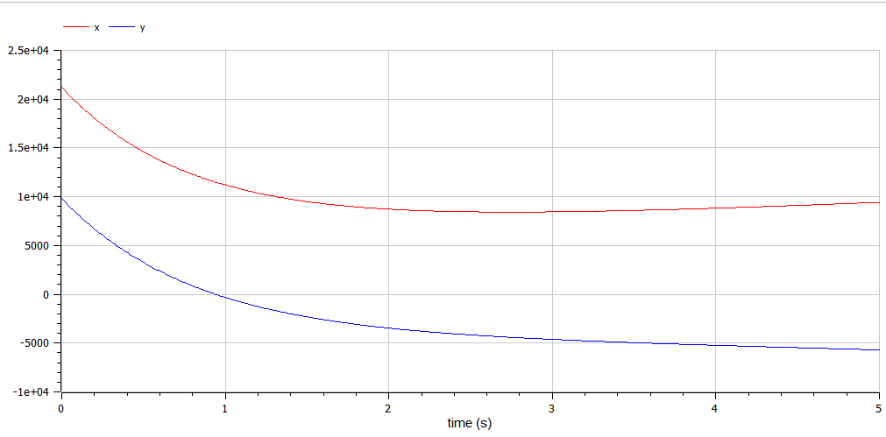
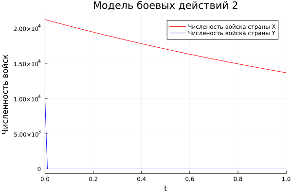
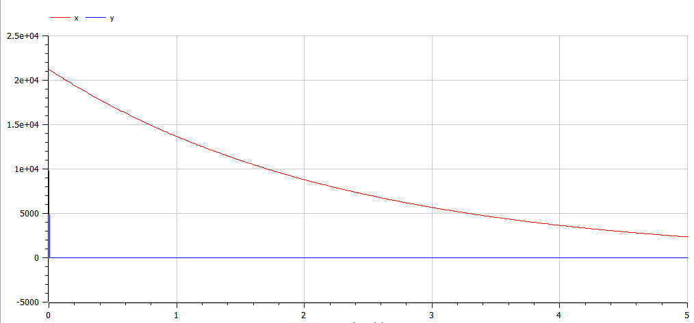

---
## Front matter
title: "Отчет по лабораторной работе №3"
subtitle: "Дисциплина: Математическое моделирование"
author: "Выполнила: Афтаева Ксения Васильевна"

## Generic otions
lang: ru-RU
toc-title: "Содержание"

## Bibliography
bibliography: bib/cite.bib
csl: pandoc/csl/gost-r-7-0-5-2008-numeric.csl

## Pdf output format
toc: true # Table of contents
toc-depth: 2
lof: true # List of figures
lot: true # List of tables
fontsize: 12pt
linestretch: 1.5
papersize: a4
documentclass: scrreprt
## I18n polyglossia
polyglossia-lang:
  name: russian
  options:
	- spelling=modern
	- babelshorthands=true
polyglossia-otherlangs:
  name: english
## I18n babel
babel-lang: russian
babel-otherlangs: english
## Fonts
mainfont: PT Serif
romanfont: PT Serif
sansfont: PT Sans
monofont: PT Mono
mainfontoptions: Ligatures=TeX
romanfontoptions: Ligatures=TeX
sansfontoptions: Ligatures=TeX,Scale=MatchLowercase
monofontoptions: Scale=MatchLowercase,Scale=0.9
## Biblatex
biblatex: true
biblio-style: "gost-numeric"
biblatexoptions:
  - parentracker=true
  - backend=biber
  - hyperref=auto
  - language=auto
  - autolang=other*
  - citestyle=gost-numeric
## Pandoc-crossref LaTeX customization
figureTitle: "Рис."
tableTitle: "Таблица"
listingTitle: "Листинг"
lofTitle: "Список иллюстраций"
lotTitle: "Список таблиц"
lolTitle: "Листинги"
## Misc options
indent: true
header-includes:
  - \usepackage{indentfirst}
  - \usepackage{float} # keep figures where there are in the text
  - \floatplacement{figure}{H} # keep figures where there are in the text
---

# Цель работы

Рассмотреть некоторые простейшие модели боевых действий – модели
Ланчестера. Выполнить задание согласно варианту: построить графики изменения численности войск армии Х и армии У для
двух случаев.


# Задание

Между страной Х и страной У идет война. Численность состава войск
исчисляется от начала войны, и являются временными функциями
$x(t)$ и $y(t)$. В
начальный момент времени страна **Х** имеет армию численностью **21 200** человек, а в распоряжении страны **Y** армия численностью в **9 800** человек. Для упрощения модели считаем, что коэффициенты a, b, c, h постоянны. Также считаем $P(t)$ и $Q(t)$ - непрерывные функции.

Построить графики изменения численности войск армии **Х** и армии **Y** для
следующих случаев:
1. Модель боевых действий между регулярными войсками
 $$\begin{cases}\frac{dx}{dt}=-0.45x(t)-0.86y(t)+\sin(t+1)\\\frac{dy}{dt}=-0.49x(t)-0.73y(t)+\cos(t+2)\end{cases}$$ 
2. Модель ведение боевых действий с участием регулярных войск и
партизанских отрядов 
$$\begin{cases}\frac{dx}{dt}=-0.44x(t)-0.7y(t)+\sin(2t)\\\frac{dy}{dt}=-0.33x(t)y(t)-0.61y(t)+\cos(t)+1\end{cases}$$

# Теоретическое введение

**Уравнение Ланчестера** - это система дифференциальных уравнений, которая описывает отношения между силами двух сторон во время битвы. Главной характеристикой соперников являются численности сторон, изменяющиеся в зависимости от различных факторов, как обусловленных действиями соперников, так и не связанных напрямую с военными действиями.

В лабораторной работе мы будем рассматривать два случая ведения боевых действий:
1. Боевые действия между регулярными войсками
2. Боевые действия с участием регулярных войск и партизанских
отрядов 

В первом случае численность регулярных войск определяется тремя
факторами:
- скорость уменьшения численности войск из-за причин, не связанных с
боевыми действиями;
- скорость потерь, обусловленных боевыми действиями
противоборствующих сторон;
- скорость поступления подкрепления 

В этом случае модель боевых действий между регулярными войсками
описывается следующим образом:

$$\begin{cases}\frac{dx}{dt}=-a(t)x(t)-b(t)y(t)+P(t)\\\frac{dy}{dt}=-c(t)x(t)-h(t)y(t)+Q(t)\end{cases}$$ 

Здесь члены $-a(t)x(t)$ и $-h(t)y(t)$ - потери, не связанные с боевыми действиями, $-b(t)y(t)$ и $-c(t)x(t)$ - потери на поле боя.
Коэффициенты $b(t)$ и $c(t)$ указывают на эффективность боевых действий со
стороны $y$ и $x$ соответственно,
$a(t)$, $h(t)$ - величины, характеризующие степень
влияния различных факторов на потери. Функции $P(t)$, $Q(t)$ учитывают
возможность подхода подкрепления к войскам $x$ и $y$ в течение одного дня.

Во втором случае в борьбу добавляются партизанские отряды. Нерегулярные
войска в отличии от постоянной армии менее уязвимы, так как действуют скрытно,
в этом случае сопернику приходится действовать неизбирательно, по площадям,
занимаемым партизанами. Поэтому считается, что тем потерь партизан,
проводящих свои операции в разных местах на некоторой известной территории,
пропорционален не только численности армейских соединений, но и численности
самих партизан. В результате модель принимает вид:

$$\begin{cases}\frac{dx}{dt}=-a(t)x(t)-b(t)y(t)+P(t)\\\frac{dy}{dt}=-c(t)x(t)y(t)-h(t)y(t)+Q(t)\end{cases}$$ 

В этой системе все величины имеют тот же смысл, что и в системе первого случая [@key-1].

# Выполнение лабораторной работы

1. Задание в лабораторной работе выполняется по вариантам. Вариант расчитывается как номер остаток от деления номера студенческого билета на число заданий + 1. Таким образом, мой вариант **10**: 1032201739 % 70 + 1.
2. Разберем теоретичскую часть для первого случая. Мы будем рассматривать модель с упрощениями, поэтому она неприменима для реальной ситуации, но может использоваться для начального анализа. 

   В простейшей модели борьбы двух противников коэффициенты $b(t)$ и
$c(t)$ являются постоянными. Попросту говоря, предполагается, что каждый солдат
армии $x$ убивает за единицу времени $c$ солдат армии $y$ (и, соответственно, каждый солдат армии $y$ убивает $b$ солдат армии $x$). Также не учитываются потери, не связанные с боевыми действиями, и возможность подхода подкрепления. Состояние системы описывается точкой $(x,y)$ положительного квадранта плоскости.
Координаты этой точки, $x$ и $y$ - это численности противостоящих армий. Тогда
модель принимает вид 

    $$\begin{cases}\dot{x}=-by\\\dot{y}=-cx\end{cases}$$ 
   Это жесткая модель, которая допускает точное решение: 

   $$\begin{cases}\frac{dx}{dy}=\frac{by}{cx}\end{cases}$$ 

    Продлелав нетрудные преобразования, получим $cx^2-by^2=C$.

    Эволюция численностей армий x и y происходит вдоль гиперболы, заданной этим уравнением (рис. @fig:001). По какой именно гиперболе пойдет война, зависит от начальной точки.

   {#fig:001 width=70%}

     Эти гиперболы разделены прямой $\sqrt{c}x=\sqrt{b}y$. Если начальная точка лежит
выше этой прямой, то гипербола выходит на ось y. Это значит, что в ходе войны
численность армии x уменьшается до нуля (за конечное время). Армия y
выигрывает, противник уничтожен.
Если начальная точка лежит ниже, то выигрывает армия x. В разделяющем
эти случаи состоянии (на прямой) война заканчивается истреблением обеих армий. 

3. Разберем теоретичскую часть для второго случая. Здесь будем учитывать те же упрощения, что и в первом случае. Так модель второго случая принимает следующий вид:

   $$\begin{cases}\frac{dx}{dt}=-by(t)\\\frac{dy}{dt}=-cx(t)y(t)\end{cases}$$ 

   Эта система приводится к уравнению 

   $$\frac{d}{dt}\left(\frac{b}{2}x^{2}(t)-cy(t)\right)=0$$

   которое при заданных начальных условиях имеет единственное решение:

   $$\frac{b}{2}x^{2}(t)-cy(t)=\frac{b}{2}x^{2}(0)-cy(0)=C_{1}$$ 

   Из рис. @fig:002 видно, что при $C_{1}>0$ побеждает регулярная армия, при $C_{1}<0$ побеждают партизаны. Аналогично противоборству регулярных войск, победа обеспечивается не только начальной численностью, но и боевой выучкой и качеством вооружения. При $C_{1}>0$ получаем соотношение $\frac{b}{2}x^{2}(0)>cy(0)$. Чтобы одержать победу партизанам необходимо увеличить коэффициент $c$ и повысить свою начальную численность на соответствующую величину. Причем это увеличение, с ростом начальной численности регулярных войск ($x(0)$) , должно расти не линейно, а пропорционально второй степени $x(0)$. 

   {#fig:002 width=70%}

4. Написала код на Julia для первого и второго случая:
```
#подключаем модули
using Plots
using DifferentialEquations

#задаем численность армий
const x0 = 21200
const y0 = 9800
#состояние системы (описывается точкой с численностями армий)
point0 = [x0, y0]
#отслеживаемый промежуток времени
time = [0.0, 5.0] 

#задаем константы согласно варианту
#первая модель
a1 = 0.45
b1 = 0.86
c1 = 0.49
h1 = 0.73
#вторая модель
a2 = 0.44
b2 = 0.7
c2 = 0.33
h2 = 0.61

#функции (возможность подкрепления)
#первая модель
function P1(t)
	return sin(t+1)
end

function Q1(t)
	return cos(t+2)
end

#вторая модель
function P2(t)
	return sin(2t)
end

function Q2(t)
	return cos(t)+1
end

#сама система 
#для первой модели	
function F_M!(dp, point, p, t)
	dp[1] = -a1*point[1] - b1*point[2] + P1(t)
	dp[2] = -c1*point[1] - h1*point[2] + Q1(t)
end

#для  второй модели
function S_M!(dp, point, p, t)
	dp[1] = -a2*point[1] - b2*point[2] + P2(t)
	dp[2] = -c2*point[1]*point[2] - h2*point[2] + Q2(t)
end
	
t=collect(LinRange(0, 1, 100))
prob1 = ODEProblem(F_M!, point0, time)
solv1 = solve(prob1, saveat=t)
prob2 = ODEProblem(S_M!, point0, time)
solv2 = solve(prob2, saveat=t)

#постреоние графиков	

#первая модель	
plt1 = plot(
	solv1, 
	vars =(0, 1), 
	color =:red,
	label ="Численость войска армии Х",
	title ="Модель боевых действий 1",
	xlabel ="Время",
	ylabel ="Численность войск"	
)

plot!(
	solv1,
	vars =(0, 2),
	color =:blue,
	label ="Численость войска страны Y"
)

savefig(plt1, "first_j.png")
	
#вторая модель		
plt2 = plot(
	solv2, 
	vars =(0, 1), 
	color =:red,
	label ="Численость войска страны Х",
	title ="Модель боевых действий 2",
	xlabel ="Время",
	ylabel ="Численность войск"	
)

plot!(
	solv2,
	vars =(0, 2),
	color =:blue,
	label ="Численость войска страны Y"
)

savefig(plt2, "second_j.png")
```

5. Написала код на OpenModelica для первого случая:
```
model lab3model1

constant Real a = 0.45;
constant Real b = 0.86;
constant Real c = 0.49;
constant Real h = 0.73;

Real P;
Real Q;

Real x(start=21200);
Real y(start=9800);

equation
P = sin(time+1);
Q = cos(time+2);
der(x) = - a * x - b * y + P;
der(y) = - c * x - h * y + Q;

end lab3model1;
```

6. Написала код на OpenModelica для второго случая (в один не получилось):
```
model lab3model1

constant Real a = 0.44;
constant Real b = 0.7;
constant Real c = 0.33;
constant Real h = 0.61;

Real P;
Real Q;

Real x(start=21200);
Real y(start=9800);

equation
P = sin(2*time);
Q = cos(time)+1;
der(x) = - a * x - b * y + P;
der(y) = - c * x * y - h * y + Q;

end lab3model1;
```

7. Посмотрим на график численности для первого случая, полученный с помощью Julia (рис. @fig:003) и OpenModelica (рис. @fig:004). Видим, что победа досталась стране **X** (так как численность армии страны **Y** стала равной 0, при том что численность армии противника положительна). 

   {#fig:003 width=70%}

   {#fig:004 width=70%}

8. Посмотрим на график численности для второго случая, полученный с помощью Julia (рис. @fig:005) и OpenModelica (рис. @fig:006). Видим, что победа досталась стране **X** (так как численность армии страны **Y** стала равной 0, при том что численность армии противника положительна). 

   {#fig:005 width=70%}

   {#fig:006 width=70%}

# Выводы

Я рассмотрела некоторые простейшие модели боевых действий – модели
Ланчестера. Выполнила задание согласно варианту: построила графики изменения численности войск армии Х и армии У для
двух случаев, определила победителей.

# Список литературы{.unnumbered}

::: {#refs}
:::
