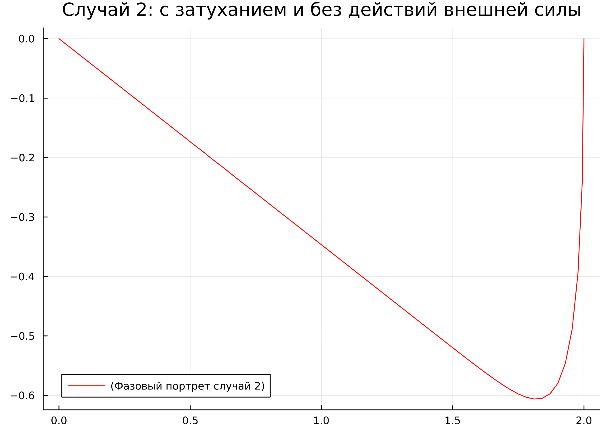

---
## Front matter
lang: ru-RU
title: Лабораторная работа №4
subtitle: Модель гармонических колебаний
author:
  - Афтаева К.В.
institute:
  - Российский университет дружбы народов, Москва, Россия
date: 4 марта 2023

## i18n babel
babel-lang: russian
babel-otherlangs: english

## Formatting pdf
toc: false
toc-title: Содержание
slide_level: 2
aspectratio: 169
section-titles: true
theme: metropolis
header-includes:
 - \metroset{progressbar=frametitle,sectionpage=progressbar,numbering=fraction}
 - '\makeatletter'
 - '\beamer@ignorenonframefalse'
 - '\makeatother'
---

# Информация

## Докладчик

:::::::::::::: {.columns align=center}
::: {.column width="70%"}

  * Афтаева Ксения Васильевна
  * студент группы НПИбд-01-20
  * Российский университет дружбы народов
  * [1032201739@pfur.ru](mailto:1032201739@pfur.ru)
  * <https:https://github.com/KVAftaeva>

:::
::: {.column width="30%"}

:::
::::::::::::::

# Вводная часть

## Актуальность

- Необходим навык математического моделирования, которое является неизбежной составляющей научно-технического прогресса

## Объект и предмет исследования

- Модель гармонических колебаний
- Julia
- OpenModelica

## Цели и задачи

Рассмотреть модель гармонических колебаний - линейный гармонических осциллятор. 

Построить фазовый портрет гармонического осциллятора и решение уравнения
гармонического осциллятора для следующих случаев:

1. Колебания гармонического осциллятора без затуханий и без действий внешней
силы $\ddot x + 7x = 0$

2. Колебания гармонического осциллятора c затуханием и без действий внешней
силы $\ddot x + 9 \dot x +3x= 0$

3. Колебания гармонического осциллятора c затуханием и под действием внешней
силы $\ddot x + 4 \dot x +x= \cos(2t)$

На интервале $t \in [0; 30]$ (шаг 0.05) с начальными условиями $x_0 = 2$, $y_0=0$.

## Материалы и методы

- Julia
- OpenModelica

# Выполнение работы

## Изучение теории

В общем виде наши уравнения это однородные ОДУ 2-го порядка (линейные):

   $$
   \ddot x(t) + a\dot x(t) + bx(t) = F(t)
   $$ 

   где $\dot x = \frac{dx}{dt}$ - производная по времени.

   Тогда система для решения:

   $$
   \begin{cases}
     \frac{dx}{dt} = y
     \\
     \frac{dy}{dt} = F(t) -ay - bx
   \end{cases}
   $$ 

## Первый случай

Колебания гармонического осциллятора без затуханий и без действий внешней силы $\ddot x + 7x = 0$. 

Система для решения первого случая

   $$
   \begin{cases}
     \dot x = y
     \\
     \dot y = -7x
   \end{cases}
   $$ 

## Написание кода для первого случая

Фрагмент кода на Julia и код на OpenModelica:

:::::::::::::: {.columns align=center}
::: {.column width="50%"}

:::
::: {.column width="50%"}

:::
::::::::::::::

## Результаты, полученные из Julia

:::::::::::::: {.columns align=center}
::: {.column width="50%"}

:::
::: {.column width="50%"}

:::
::::::::::::::

## Результаты, полученные из OpenModelica

:::::::::::::: {.columns align=center}
::: {.column width="50%"}

:::
::: {.column width="50%"}

:::
::::::::::::::

## Второй случай

Колебания гармонического осциллятора c затуханием и без действий внешней силы $\ddot x + 9 \dot x +3x= 0$. 

Система для решения второго случая

   $$
   \begin{cases}
     \dot x = y
     \\
     \dot y = -9y - 3x
   \end{cases}
   $$ 

## Написание кода для второго случая

Фрагмент кода на Julia и код на OpenModelica:

:::::::::::::: {.columns align=center}
::: {.column width="50%"}

:::
::: {.column width="50%"}

:::
::::::::::::::

## Результаты, полученные из Julia

:::::::::::::: {.columns align=center}
::: {.column width="50%"}

:::
::: {.column width="50%"}

:::
::::::::::::::

## Результаты, полученные из OpenModelica

:::::::::::::: {.columns align=center}
::: {.column width="50%"}

:::
::: {.column width="50%"}

:::
::::::::::::::

## Третий случай

Колебания гармонического осциллятора c затуханием и под действием внешней силы $\ddot x + 4 \dot x +x= \cos(2t)$. 

Система для решенияи третьего случая

   $$
   \begin{cases}
     \dot x = y
     \\
     \dot y = \cos(2t) -4y -x
   \end{cases}
   $$ 

## Написание кода для третьего случая

Фрагмент кода на Julia и код на OpenModelica:

:::::::::::::: {.columns align=center}
::: {.column width="50%"}

:::
::: {.column width="50%"}

:::
::::::::::::::

## Результаты, полученные из Julia

:::::::::::::: {.columns align=center}
::: {.column width="50%"}

:::
::: {.column width="50%"}

:::
::::::::::::::

## Результаты, полученные из OpenModelica

:::::::::::::: {.columns align=center}
::: {.column width="50%"}

:::
::: {.column width="50%"}

:::
::::::::::::::

# Результаты

## Результат

Я построила фазовый портрет гармонического осциллятора и решение уравнения
гармонического осциллятора для следующих случаев:

1. Колебания гармонического осциллятора без затуханий и без действий внешней
силы $\ddot x + 7x = 0$

2. Колебания гармонического осциллятора c затуханием и без действий внешней
силы $\ddot x + 9 \dot x +3x= 0$

3. Колебания гармонического осциллятора c затуханием и под действием внешней
силы $\ddot x + 4 \dot x +x= \cos(2t)$

На интервале $t \in [0; 30]$ (шаг 0.05) с начальными условиями $x_0 = 2$, $y_0=0$.

# Вывод

## Вывод

Я рассмотрела модель гармонических колебаний - линейный гармонических осциллятор. Выполнила задание согласно варианту: построила фазовый портрет гармонического осциллятора и решение уравнения гармонического осциллятора для трех случаев. 