---
## Front matter
title: "Отчет по лабораторной работе №4"
subtitle: "Дисциплина: Математическое моделирование"
author: "Выполнила: Афтаева Ксения Васильевна"

## Generic otions
lang: ru-RU
toc-title: "Содержание"

## Bibliography
bibliography: bib/cite.bib
csl: pandoc/csl/gost-r-7-0-5-2008-numeric.csl

## Pdf output format
toc: true # Table of contents
toc-depth: 2
lof: true # List of figures
lot: true # List of tables
fontsize: 12pt
linestretch: 1.5
papersize: a4
documentclass: scrreprt
## I18n polyglossia
polyglossia-lang:
  name: russian
  options:
	- spelling=modern
	- babelshorthands=true
polyglossia-otherlangs:
  name: english
## I18n babel
babel-lang: russian
babel-otherlangs: english
## Fonts
mainfont: PT Serif
romanfont: PT Serif
sansfont: PT Sans
monofont: PT Mono
mainfontoptions: Ligatures=TeX
romanfontoptions: Ligatures=TeX
sansfontoptions: Ligatures=TeX,Scale=MatchLowercase
monofontoptions: Scale=MatchLowercase,Scale=0.9
## Biblatex
biblatex: true
biblio-style: "gost-numeric"
biblatexoptions:
  - parentracker=true
  - backend=biber
  - hyperref=auto
  - language=auto
  - autolang=other*
  - citestyle=gost-numeric
## Pandoc-crossref LaTeX customization
figureTitle: "Рис."
tableTitle: "Таблица"
listingTitle: "Листинг"
lofTitle: "Список иллюстраций"
lotTitle: "Список таблиц"
lolTitle: "Листинги"
## Misc options
indent: true
header-includes:
  - \usepackage{indentfirst}
  - \usepackage{float} # keep figures where there are in the text
  - \floatplacement{figure}{H} # keep figures where there are in the text
---

# Цель работы

Рассмотреть модель гармонических колебаний - линейный гармонических осциллятор. Выполнить задание согласно варианту: построить фазовый портрет гармонического осциллятора и решение уравнения гармонического осциллятора для трех случаев. 

# Задание

**Вариант № 10**:

Построить фазовый портрет гармонического осциллятора и решение уравнения
гармонического осциллятора для следующих случаев:

1. Колебания гармонического осциллятора без затуханий и без действий внешней
силы $\ddot x + 7x = 0$

2. Колебания гармонического осциллятора c затуханием и без действий внешней
силы $\ddot x + 9 \dot x +3x= 0$

3. Колебания гармонического осциллятора c затуханием и под действием внешней
силы $\ddot x + 4 \dot x +x= \cos(2t)$

На интервале $t \in [0; 30]$ (шаг 0.05) с начальными условиями $x_0 = 2$, $y_0=0$.

# Теоретическое введение

**Гармоническое колебание** — явление периодического изменения какой-либо величины, при котором зависимость от аргумента имеет характер функции синуса или косинуса [@key-1]. 

Гармонические колебания выделяются из всех остальных видов колебаний по следующим причинам:

- очень часто малые колебания, как свободные, так и вынужденные, которые происходят в реальных системах, можно считать имеющими форму гармонических колебаний или очень близкую к ней;

- широкий класс периодических функций может быть разложен на сумму тригонометрических компонентов, то есть  любое колебание может быть представлено как сумма гармонических колебаний;

- для широкого класса систем откликом на гармоническое воздействие является гармоническое колебание (свойство линейности), при этом связь воздействия и отклика является устойчивой характеристикой системы [@key-2]. 

**Линейный гармонический осциллятор** — система, совершающая одномерное движение под действием квазиупругой силы, — является моделью, используемой во многих задачах классической и квантовой теории. Пружинный, физический и математический маятники — примеры классических гармонических осцилляторов [@key-2].

Движение грузика на пружинке, маятника, заряда в электрическом контуре, а
также эволюция во времени многих систем в физике, химии, биологии и других
науках при определенных предположениях можно описать одним и тем же
дифференциальным уравнением, которое в теории колебаний выступает в качестве
основной модели. Эта модель называется линейным гармоническим осциллятором [@key-3].

Уравнение свободных колебаний гармонического осциллятора имеет
следующий вид:

$$
\ddot x+2\gamma\dot x+\omega^2_0x=0
$$ {#eq:01} 


где $x$ – переменная, описывающая состояние системы (смещение грузика, заряд конденсатора и т.д.), $\gamma$ – параметр, характеризующий потери энергии (трение в механической системе, сопротивление в контуре), $\omega_0$ – собственная частота колебаний, $t$ – время. (Обозначения $\ddot x = \frac{d^2x}{dt^2}$, $\dot x = {dx}{dt}$)

Уравнение [-@eq:01] есть линейное однородное дифференциальное уравнение
второго порядка и оно является примером линейной динамической системы.

При отсутствии потерь в системе ($\gamma = 0$) вместо уравнения [-@eq:01] получаем
уравнение консервативного осциллятора энергия колебания которого сохраняется
во времени.

$$
\ddot x + \omega^2_0x = 0
$$ {#eq:02}

Для однозначной разрешимости уравнения второго порядка [-@eq:02] необходимо
задать два начальных условия вида:

$$
\begin{cases}
x(t_0) = x_0
\\
\dot x(t_0) = y_0
\end{cases}
$$ {#eq:03}

Уравнение второго порядка [-@eq:02] можно представить в виде системы двух
уравнений первого порядка:

$$
\begin{cases}
\dot x = y
\\
\dot y = -\omega^2_0x
\end{cases}
$$ {#eq:04}

Начальные условия [-@eq:03] для системы [-eq:04] примут вид:

$$
\begin{cases}
x(t_0) = x_0
\\
y(t_0) = y_0
\end{cases}
$$ {#eq:05}

Независимые переменные $x$, $y$ определяют пространство, в котором
«движется» решение. Это фазовое пространство системы, поскольку оно двумерно будем называть его фазовой плоскостью.

Значение фазовых координат $x$, $y$ в любой момент времени полностью
определяет состояние системы. Решению уравнения движения как функции
времени отвечает гладкая кривая в фазовой плоскости. Она называется фазовой
траекторией. Если множество различных решений (соответствующих различным
начальным условиям) изобразить на одной фазовой плоскости, возникает общая
картина поведения системы. Такую картину, образованную набором фазовых
траекторий, называют **фазовым портретом** [3].

# Выполнение лабораторной работы

1. Задание в лабораторной работе выполняется по вариантам. Вариант расчитывается как номер остаток от деления номера студенческого билета на число заданий + 1. Таким образом, мой вариант **10**: 1032201739 % 70 + 1.

2. Разберем теоретичскую часть. 

    В общем виде наши уравнения это однородные ОДУ 2-го порядка (линейные):

   $$
   \ddot x(t) + a\dot x(t) + bx(t) = F(t)
   $$ {#eq:06}

   где $\dot x = \frac{dx}{dt}$ - производная по времени.

   Если $F(t) = 0$ и $b \ne 0$, значит есть трение и система затухнет. Если $F(t) = 0$ и $b = 0$, то трения нет.Если $F(t) \ne 0$, то система никогда не затухнет.


   Можно сделать систему ОДУ:

   $y = \frac{dx}{dt} = \dot x(t)$ --> 
   $\frac{d^2x}{dt^2} = \frac{dy}{dt}$ --> $\frac{dy}{dt} + ay(t) + bx(t) = 0$ 

   Тогда система для решения:

   $$
   \begin{cases}
     \frac{dx}{dt} = y
     \\
     \frac{dy}{dt} = F(t) -ay - bx
   \end{cases}
   $$ {#eq:07}

3. Разберем три случая в нашем задании. 

   В первом случае мы работаем с колебаниями гармонического осциллятора без затуханий и без действий внешней силы $\ddot x + 7x = 0$. Тогда, по общему виду [-@eq:05] видим, что $a=0$, $F(x)=0$, $b=7$. Подставляем значения в систему для решения [-@eq:07] и получаем систему для решения первого случая

   $$
   \begin{cases}
     \dot x = y
     \\
     \dot y = -7x
   \end{cases}
   $$ {#eq:08}

   Во втором случае мы работаем с колебаниями гармонического осциллятора c затуханием и без действий внешней силы $\ddot x + 9 \dot x +3x= 0$. Тогда по общему виду [-@eq:05] видим, что $a=9$, $F(x)=0$, $b=3$. Подставляем значения в систему для решения [-@eq:07] и получаем систему для решения второго случая

   $$
   \begin{cases}
     \dot x = y
     \\
     \dot y = -9y - 3x
   \end{cases}
   $$ {#eq:9}

   В третьем случае мы работаем с колебаниями гармонического осциллятора c затуханием и под действием внешней силы $\ddot x + 4 \dot x +x= \cos(2t)$. Тогда по общему виду [-@eq:05] видим, что $a=4$, $F(x)=\cos(2t)$, $b=1$. Подставляем значения в систему для решения [-@eq:07] и получаем систему для решения третьего случая

   $$
   \begin{cases}
     \dot x = y
     \\
     \dot y = \cos(2t) -4y -x
   \end{cases}
   $$ {#eq:10}

4.  Напишем код для первого случая на Julia:

```
#подключаем модули
using Plots
using DifferentialEquations

#задаем начальные условия
const x0 = 2
const y0 = 0

#состояние системы 
u0 = [x0, y0]
#отслеживаемый промежуток времени
time = [0.0, 30.0] 

#задаем константы согласно варианту и случаю
a = 0
b = 7

#сама система 
function M!(du, u, p, t)
	du[1] = u[2]
	du[2] = -a*u[2]-b*u[1]
end

prob = ODEProblem(M!, u0, time)
sol = solve(prob, saveat=0.05)

const X = Float64[]
const Y = Float64[]

for u in sol.u
	x, y = u
	push!(X,x)
	push!(Y,y)
end
 
#постреоние графиков 
plt1 = plot(
	dpi = 300,
	size = (700,500),
	title ="Случай 1: без затуханий и без действий внешней силы"
)

plot!(
	plt1,
	sol.t,
	X,
	color =:red,
	label ="x"
)

plot!(
	plt1,
	sol.t,
	Y,
	color =:blue,
	label ="y"
)

savefig(plt1, "first.png")

plt2 = plot(
	dpi = 300,
	size = (700,500),
	title ="Случай 1: без затуханий и без действий внешней силы"
)

plot!(
	plt2,
	X,
	Y,
	color =:red,
	label ="(Фазовый портрет случай 1)"
)

savefig(plt2, "first_php.png")

```

5. Напишем код для первого случая на OpenModelica:

```
model lab4_om1

  Real x(start=2.0);
  Real y(start=0.0);
  constant Real a = 0.0;
  constant Real b = 7.0;
  
equation
  der(x) = y;
  der(y) = -a*y-b*x;
  
end lab4_om1;
```

6. Посмотрим на результаты, полученные с помощью Julia для первого случая: решение уравнения гармонического осциллятора (рис. @fig:001) и фазовый портрет гармонического осциллятора (рис. @fig:002).

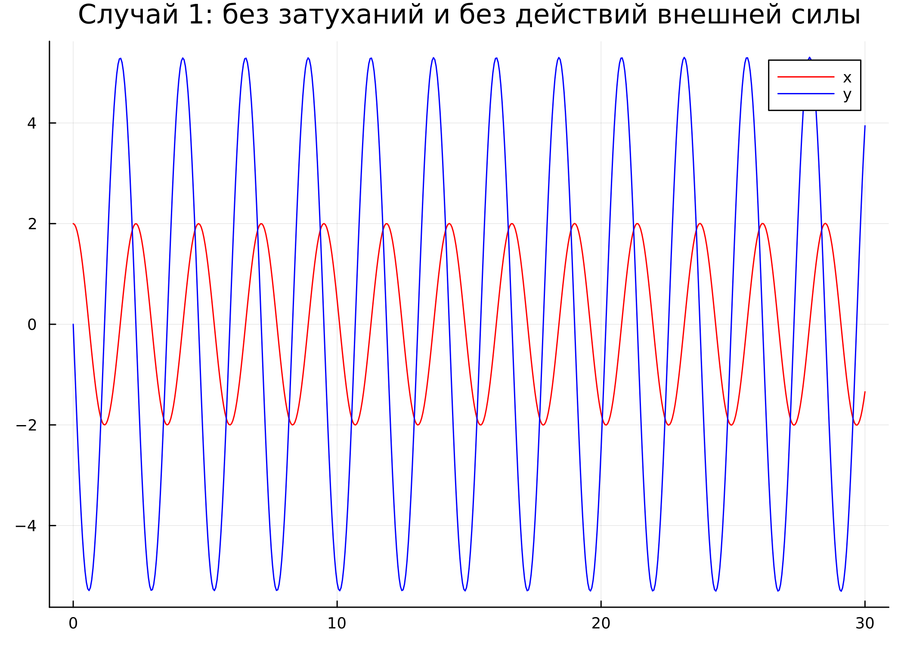{#fig:001 width=70%}

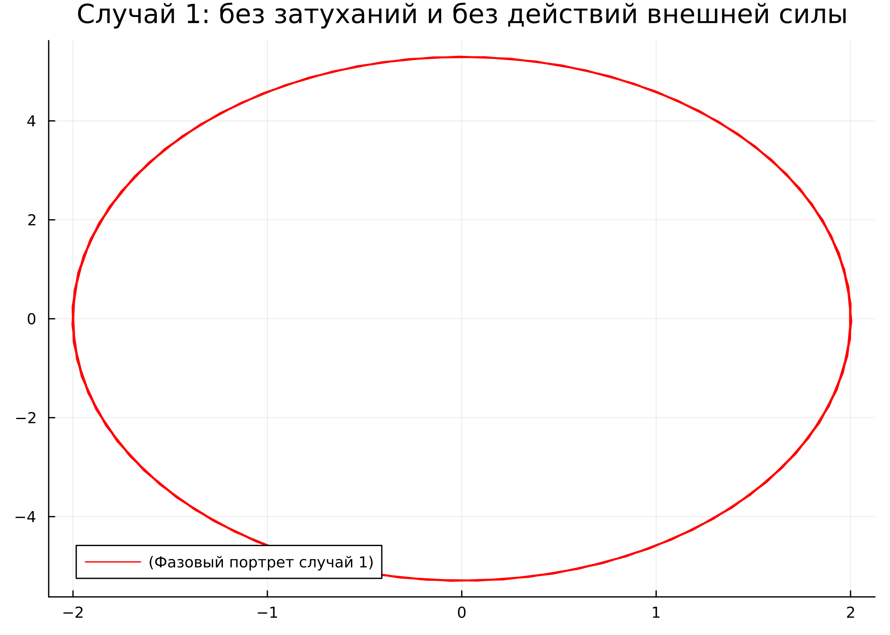{#fig:002 width=70%}

7. Посмотрим на результаты, полученные с помощью OpenModelica для первого случая: решение уравнения гармонического осциллятора (рис. @fig:003) и фазовый портрет гармонического осциллятора (рис. @fig:004).

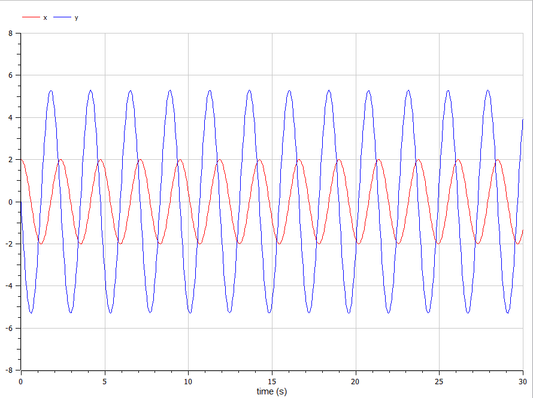{#fig:003 width=70%}

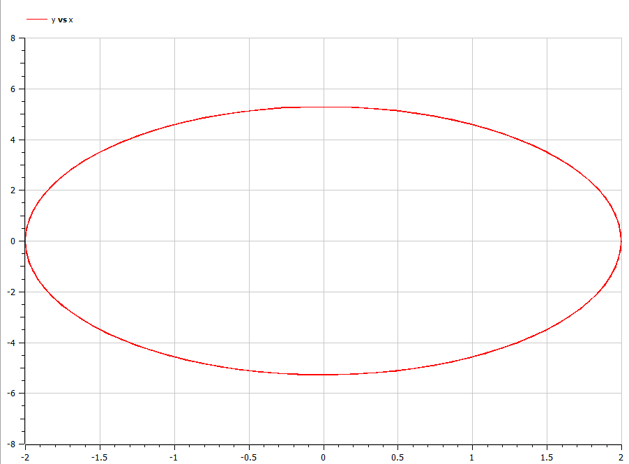{#fig:004 width=70%}

8.  Напишем код для второго случая на Julia:

```
#подключаем модули
using Plots
using DifferentialEquations

#задаем начальные условия
const x0 = 2
const y0 = 0

#состояние системы 
u0 = [x0, y0]
#отслеживаемый промежуток времени
time = [0.0, 30.0] 

#задаем константы согласно варианту и случаю
a = 9
b = 3

#сама система 
function M!(du, u, p, t)
	du[1] = u[2]
	du[2] = -a*u[2]-b*u[1]
end

prob = ODEProblem(M!, u0, time)
sol = solve(prob, saveat=0.05)

const X = Float64[]
const Y = Float64[]

for u in sol.u
	x, y = u
	push!(X,x)
	push!(Y,y)
end
 
#постреоние графиков 
plt1 = plot(
	dpi = 300,
	size = (700,500),
	title ="Случай 2: с затуханием и без действий внешней силы"
)

plot!(
	plt1,
	sol.t,
	X,
	color =:red,
	label ="x"
)

plot!(
	plt1,
	sol.t,
	Y,
	color =:blue,
	label ="y"
)

savefig(plt1, "second.png")

plt2 = plot(
	dpi = 300,
	size = (700,500),
	title ="Случай 2: с затуханием и без действий внешней силы"
)

plot!(
	plt2,
	X,
	Y,
	color =:red,
	label ="(Фазовый портрет случай 2)"
)

savefig(plt2, "second_php.png")
```

9. Напишем код для второго случая на OpenModelica:

```
model lab4_om2

  Real x(start=2.0);
  Real y(start=0.0);
  constant Real a = 9.0;
  constant Real b = 3.0;
  
equation
  der(x) = y;
  der(y) = -a*y-b*x;
  
end lab4_om2;

```
10. Посмотрим на результаты, полученные с помощью Julia для второго случая: решение уравнения гармонического осциллятора (рис. @fig:005) и фазовый портрет гармонического осциллятора (рис. @fig:006).

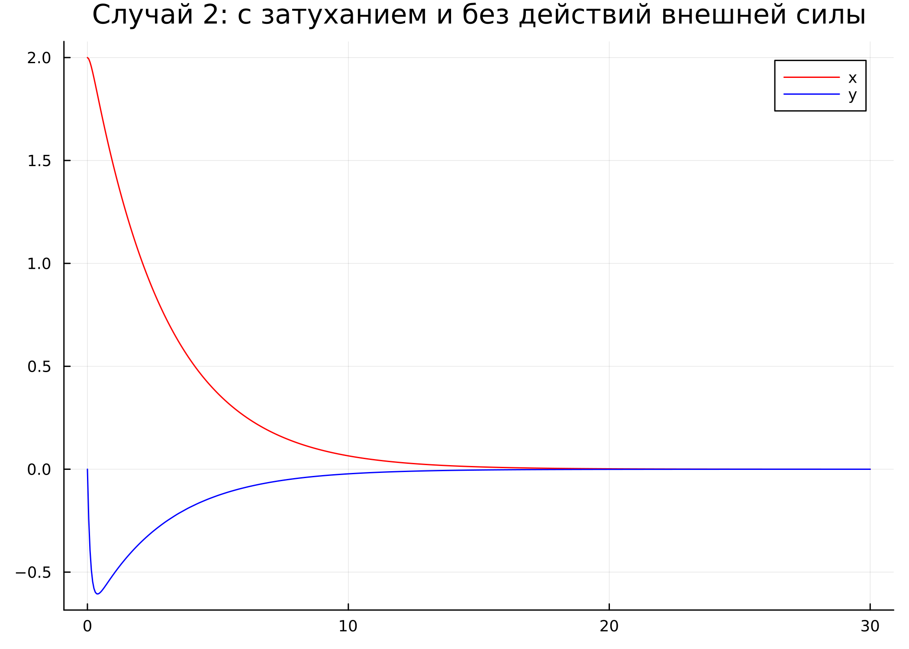{#fig:005 width=70%}

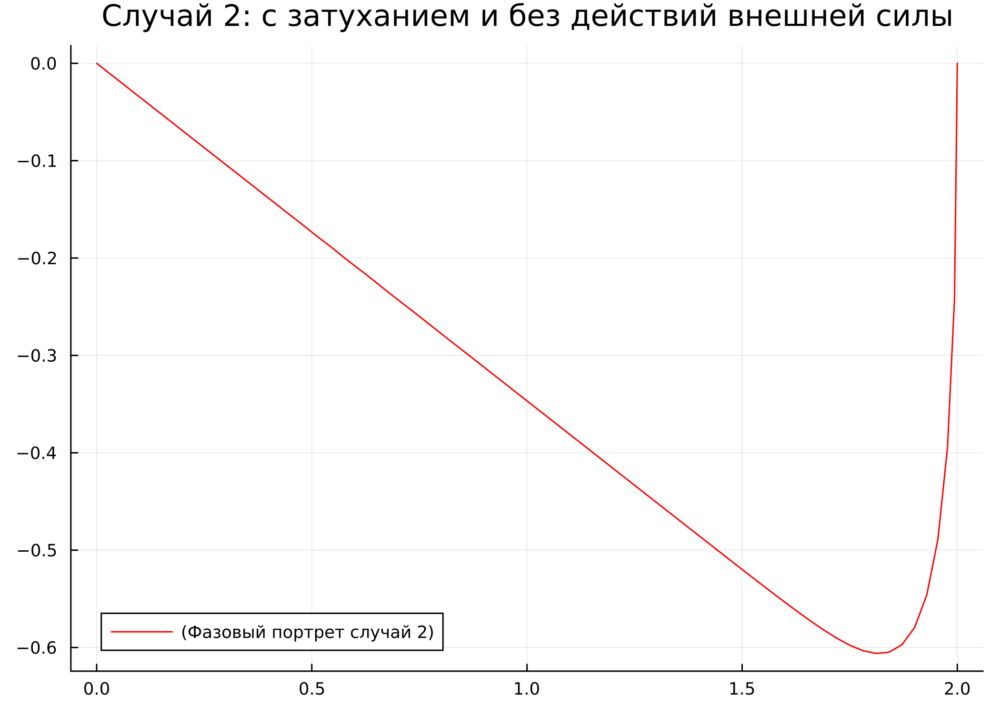{#fig:006 width=70%}

11. Посмотрим на результаты, полученные с помощью OpenModelica для второго случая: решение уравнения гармонического осциллятора (рис. @fig:007) и фазовый портрет гармонического осциллятора (рис. @fig:008).

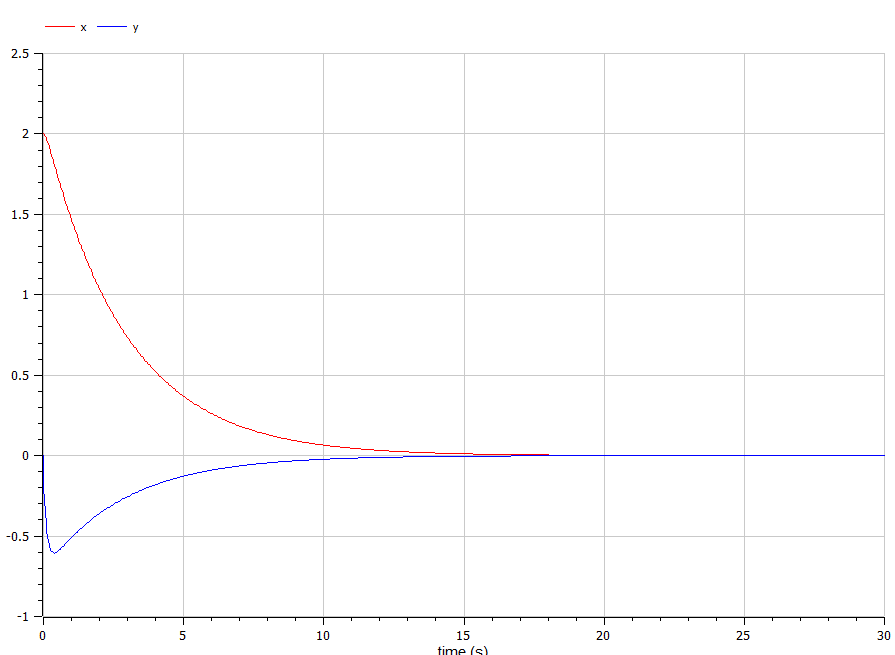{#fig:007 width=70%}

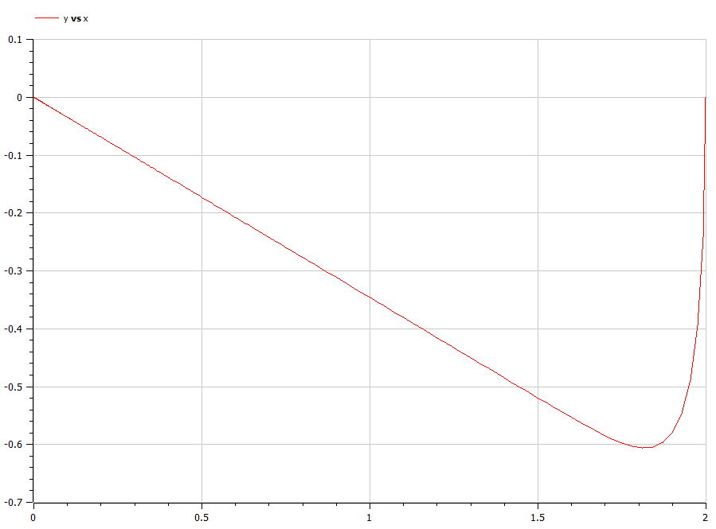{#fig:008 width=70%}

12.  Напишем код для третьего случая на Julia:

```
#подключаем модули
using Plots
using DifferentialEquations

#задаем начальные условия
const x0 = 2
const y0 = 0

#состояние системы 
u0 = [x0, y0]
#отслеживаемый промежуток времени
time = [0.0, 30.0] 

#задаем константы согласно варианту и случаю
a = 4
b = 1

#сама система 
function M!(du, u, p, t)
	du[1] = u[2]
	du[2] = cos(2*t)-a*u[2]-b*u[1]
end

prob = ODEProblem(M!, u0, time)
sol = solve(prob, saveat=0.05)

const X = Float64[]
const Y = Float64[]

for u in sol.u
	x, y = u
	push!(X,x)
	push!(Y,y)
end
 
#постреоние графиков 
plt1 = plot(
	dpi = 300,
	size = (700,500),
	title ="Случай 3: с затуханием и под действием внешней силы"
)

plot!(
	plt1,
	sol.t,
	X,
	color =:red,
	label ="x"
)

plot!(
	plt1,
	sol.t,
	Y,
	color =:blue,
	label ="y"
)

savefig(plt1, "third.png")

plt2 = plot(
	dpi = 300,
	size = (700,500),
	title ="Случай 3: с затуханием и под действием внешней силы"
)

plot!(
	plt2,
	X,
	Y,
	color =:red,
	label ="(Фазовый портрет случай 3)"
)

savefig(plt2, "third_php.png")

```

13. Напишем код для первого случая на OpenModelica:

```
model lab4_om3

  Real x(start=2.0);
  Real y(start=0.0);
  constant Real a = 4.0;
  constant Real b = 1.0;
  
equation
  der(x) = y;
  der(y) = cos(2*time)-a*y-b*x;

end lab4_om3;

```

14. Посмотрим на результаты, полученные с помощью Julia для третьего случая: решение уравнения гармонического осциллятора (рис. @fig:009) и фазовый портрет гармонического осциллятора (рис. @fig:010).

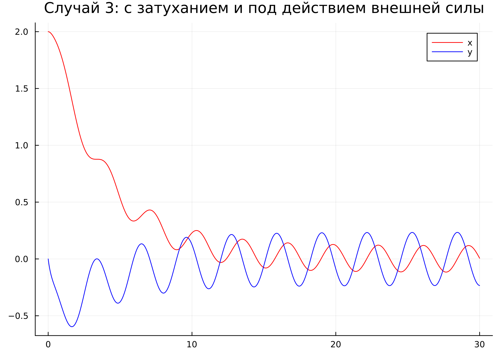{#fig:009 width=70%}

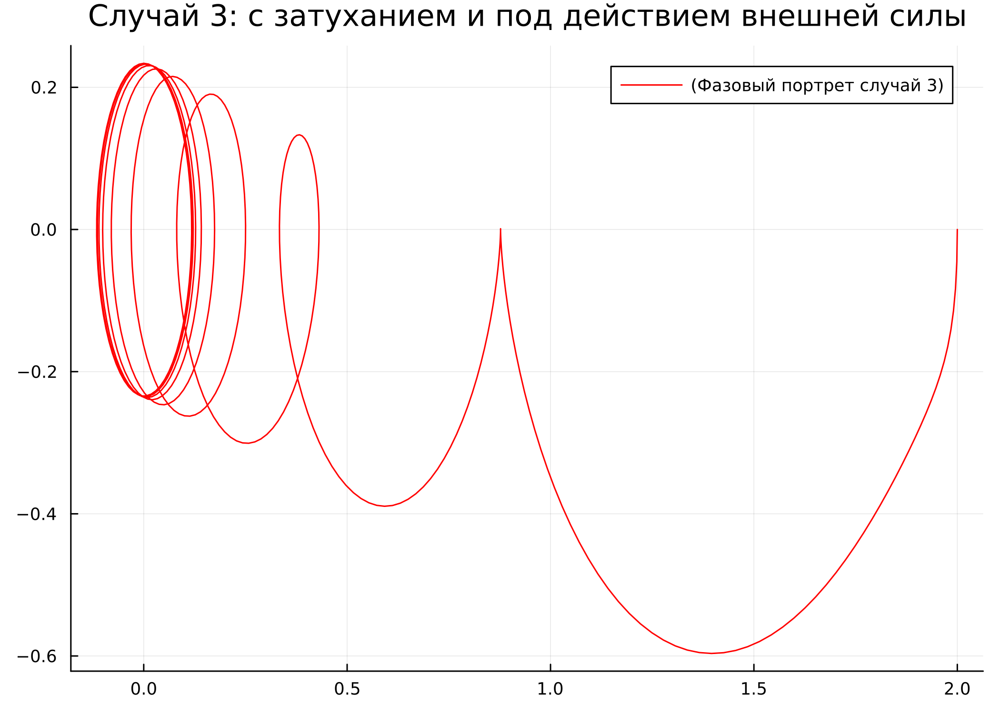{#fig:010 width=70%}

15. Посмотрим на результаты, полученные с помощью OpenModelica для третьего случая: решение уравнения гармонического осциллятора (рис. @fig:011) и фазовый портрет гармонического осциллятора (рис. @fig:012).

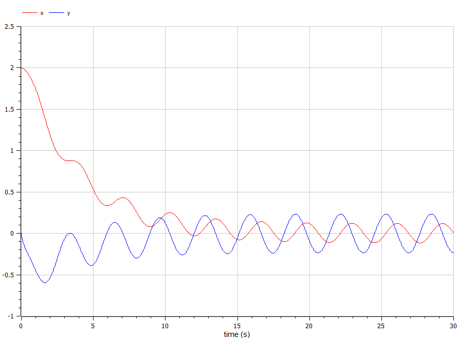{#fig:011 width=70%}

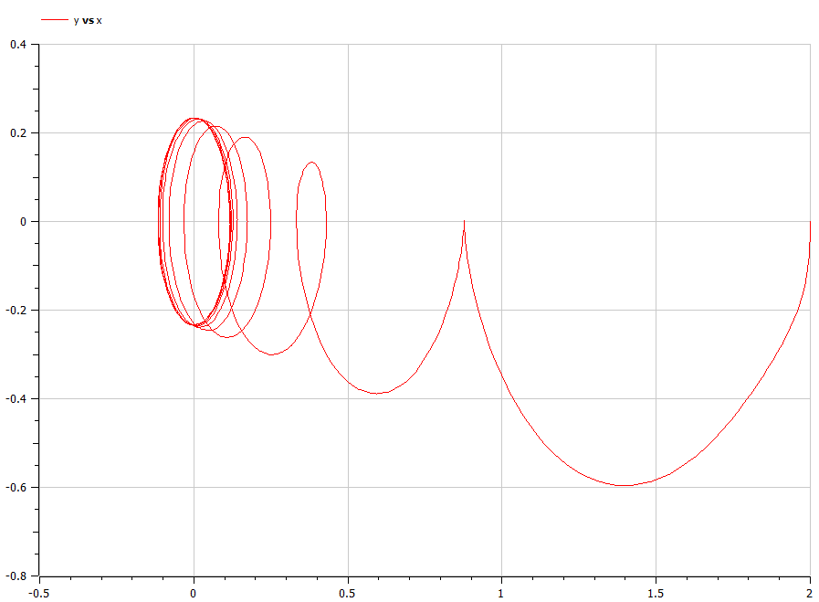{#fig:012 width=70%}

# Выводы

Я рассмотрела модель гармонических колебаний - линейный гармонических осциллятор. Выполнила задание согласно варианту: построила фазовый портрет гармонического осциллятора и решение уравнения гармонического осциллятора для трех случаев. 

# Список литературы{.unnumbered}

::: {#refs}
:::
