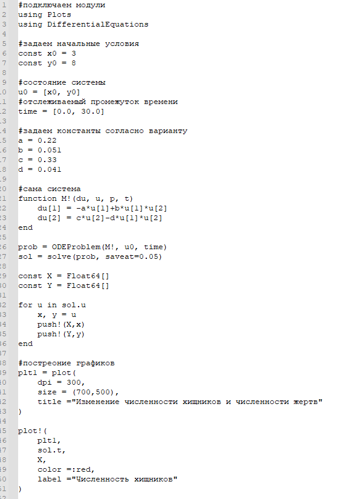
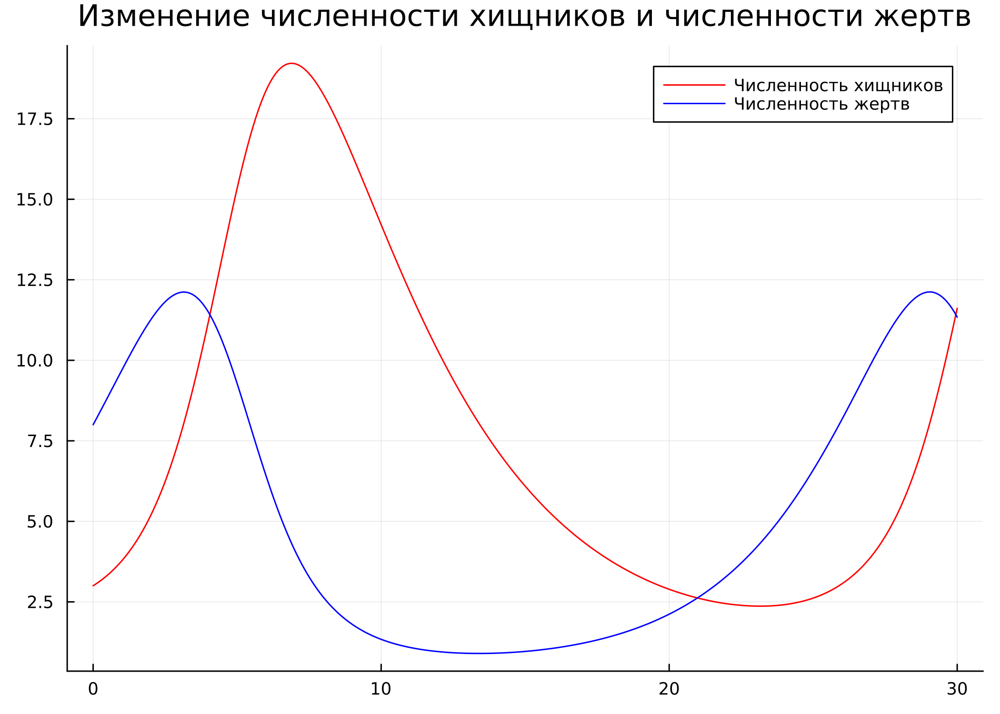

---
## Front matter
lang: ru-RU
title: Лабораторная работа №5
subtitle: Модель хищник-жертва
author:
  - Афтаева К.В.
institute:
  - Российский университет дружбы народов, Москва, Россия
date: 9 марта 2023

## i18n babel
babel-lang: russian
babel-otherlangs: english

## Formatting pdf
toc: false
toc-title: Содержание
slide_level: 2
aspectratio: 169
section-titles: true
theme: metropolis
header-includes:
 - \metroset{progressbar=frametitle,sectionpage=progressbar,numbering=fraction}
 - '\makeatletter'
 - '\beamer@ignorenonframefalse'
 - '\makeatother'
---

# Информация

## Докладчик

:::::::::::::: {.columns align=center}
::: {.column width="70%"}

  * Афтаева Ксения Васильевна
  * студент группы НПИбд-01-20
  * Российский университет дружбы народов
  * [1032201739@pfur.ru](mailto:1032201739@pfur.ru)
  * <https:https://github.com/KVAftaeva>

:::
::: {.column width="30%"}

:::
::::::::::::::

# Вводная часть

## Актуальность

- Необходим навык математического моделирования, которое является неизбежной составляющей научно-технического прогресса

## Объект и предмет исследования

- Модель хищник-жертва
- Julia
- OpenModelica

## Цели и задачи

Рассмотреть простейшую модель взаимодействия двух видов типа «хищник — жертва» - модель Лотки-Вольтерры. 

Выполнить задание согласно варианту: 
для модели «хищник-жертва»:

 $$
   \begin{cases}
     \frac{dx}{dt} = -0.22x(t)+0.051x(t)y(t)
     \\
     \frac{dy}{dt} = 0.33y(t)-0.041x(t)y(t)
   \end{cases}
$$ 

построить график зависимости численности хищников от численности жертв,
а также графики изменения численности хищников и численности жертв при
следующих начальных условиях: $x_0 = 3$, $y_0 = 8$. Найти стационарное
состояние системы.

## Материалы и методы

- Julia
- OpenModelica

# Выполнение работы

## Изучение теории

$$
   \begin{cases}
     \frac{dx}{dt} = -ax(t)+bx(t)y(t)
     \\
     \frac{dy}{dt} = cy(t)-dx(t)y(t)
   \end{cases}
$$ 

В этой модели $x$ – число хищников, $y$ - число жертв. Коэффициент $c$
описывает скорость естественного прироста числа жертв в отсутствие хищников, $a$ - естественное вымирание хищников, лишенных пищи в виде жертв. Вероятность
взаимодействия жертвы и хищника считается пропорциональной как количеству
жертв, так и числу самих хищников ($xy$). Каждый акт взаимодействия уменьшает
популяцию жертв, но способствует увеличению популяции хищников (члены $dxy$
и $-bxy$ в правой части уравнения) 

## Написание кода 

Фрагмент кода на Julia и код на OpenModelica:

:::::::::::::: {.columns align=center}
::: {.column width="50%"}

:::
::: {.column width="50%"}

:::
::::::::::::::

## Результаты, полученные из Julia

:::::::::::::: {.columns align=center}
::: {.column width="50%"}

:::
::: {.column width="50%"}

:::
::::::::::::::

## Результаты, полученные из OpenModelica

:::::::::::::: {.columns align=center}
::: {.column width="50%"}

:::
::: {.column width="50%"}

:::
::::::::::::::

## Стационарное состояние системы

$x_0=\frac{a}{b}$, $y_0=\frac{c}{d}$

:::::::::::::: {.columns align=center}
::: {.column width="50%"}

:::
::: {.column width="50%"}

:::
::::::::::::::

# Результаты

## Результат

Для модели «хищник-жертва»:

 $$
   \begin{cases}
     \frac{dx}{dt} = -0.22x(t)+0.051x(t)y(t)
     \\
     \frac{dy}{dt} = 0.33y(t)-0.041x(t)y(t)
   \end{cases}
$$

Построила график зависимости численности хищников от численности жертв,
а также графики изменения численности хищников и численности жертв при
следующих начальных условиях: $x_0 = 3$, $y_0 = 8$. Нашла стационарное
состояние системы.

# Вывод

## Вывод

Я рассмотрела простейшую модель взаимодействия двух видов типа «хищник — жертва» -
модель Лотки-Вольтерры. Выполнила задание согласно варианту: построила график зависимости численности хищников от численности жертв, а также графики изменения численности хищников и численности жертв при заданных начальных условиях, нашла стационарное сосотояние системы.