---
## Front matter
lang: ru-RU
title: Лабораторная работа №7
subtitle: Эффективность рекламы
author:
  - Афтаева К.В.
institute:
  - Российский университет дружбы народов, Москва, Россия
date: 25 марта 2023

## i18n babel
babel-lang: russian
babel-otherlangs: english

## Formatting pdf
toc: false
toc-title: Содержание
slide_level: 2
aspectratio: 169
section-titles: true
theme: metropolis
header-includes:
 - \metroset{progressbar=frametitle,sectionpage=progressbar,numbering=fraction}
 - '\makeatletter'
 - '\beamer@ignorenonframefalse'
 - '\makeatother'
---

# Информация

## Докладчик

:::::::::::::: {.columns align=center}
::: {.column width="70%"}

  * Афтаева Ксения Васильевна
  * студент группы НПИбд-01-20
  * Российский университет дружбы народов
  * [1032201739@pfur.ru](mailto:1032201739@pfur.ru)
  * <https:https://github.com/KVAftaeva>

:::
::: {.column width="30%"}

:::
::::::::::::::

# Вводная часть

## Актуальность

- Необходим навык математического моделирования, которое является неизбежной составляющей научно-технического прогресса

## Объект и предмет исследования

- Модель распространения рекламы
- Julia
- OpenModelica

## Цели и задачи

Рассмотреть модель рекламной компании. 

Построить график распространения рекламы, математическая модель которой описывается следующим уравнением: 

1. $\frac{dn}{dt}=(0.95+0.0008n(t))(N-n(t))$

2. $\frac{dn}{dt}=(0.000095+0.92n(t))(N-n(t))$

2. $\frac{dn}{dt}=(0.95\sin(t)+0.93\cos(9t)n(t))(N-n(t))$

При этом объем аудитории $N=995$, в начальный момент о товаре знает $9$ человек. Для
случая 2 определить в какой момент времени скорость распространения рекламы будет
иметь максимальное значение.

## Материалы и методы

- Julia
- OpenModelica

# Выполнение работы

## Написание кода для первого случая
:::::::::::::: {.columns align=center}
::: {.column width="50%"}
Фрагмент кода на Julia

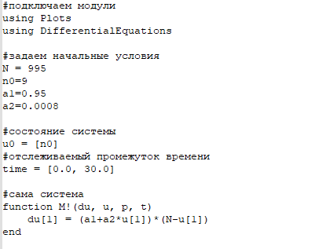

:::
::: {.column width="50%"}

Код на OpenModelica

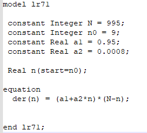
:::
::::::::::::::

## Результаты для первого случая

:::::::::::::: {.columns align=center}
::: {.column width="50%"}

Из Julia

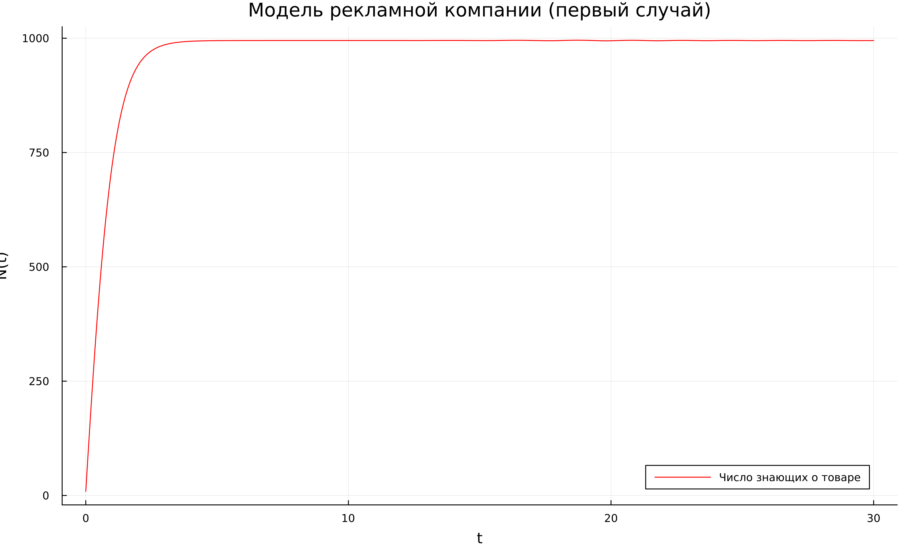

:::
::: {.column width="50%"}

Из OpenModelica

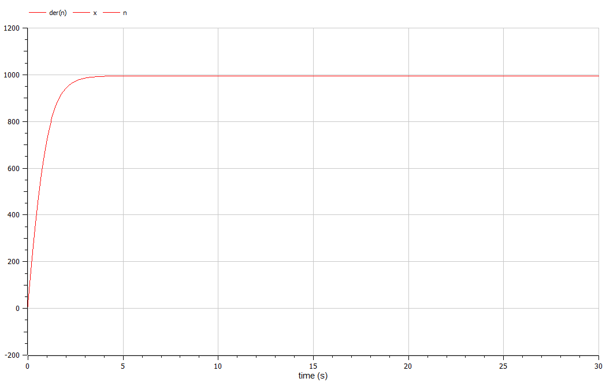
:::
::::::::::::::

## Написание кода для второго случая
:::::::::::::: {.columns align=center}
::: {.column width="50%"}
Фрагмент кода на Julia
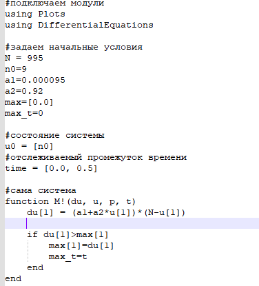

:::
::: {.column width="50%"}

Код на OpenModelica

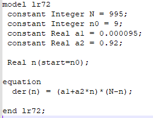
:::
::::::::::::::

## Результаты для второго случая

:::::::::::::: {.columns align=center}
::: {.column width="50%"}

Из Julia
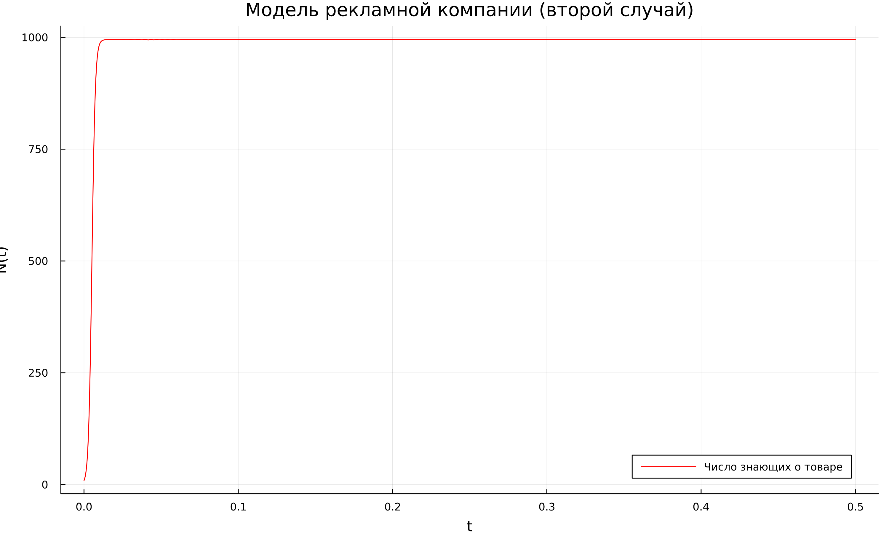

:::
::: {.column width="50%"}

Из OpenModelica
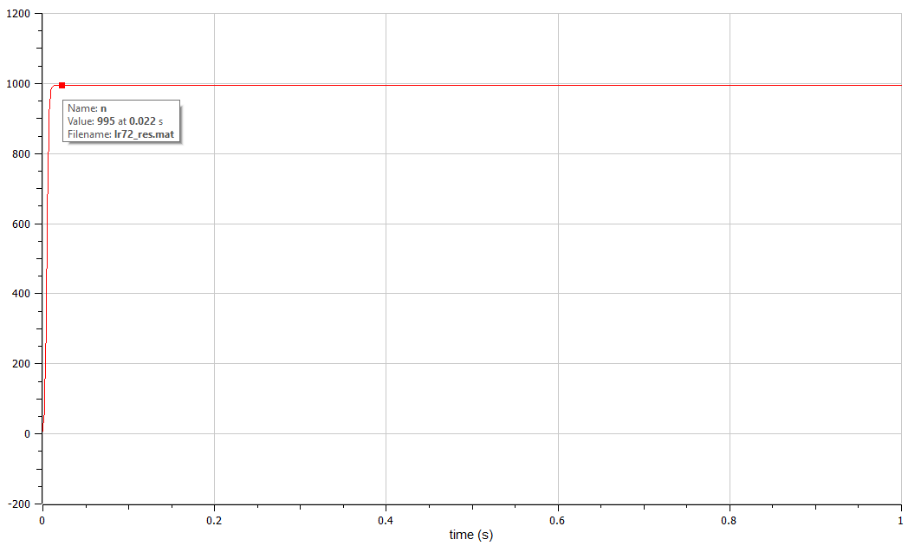
:::
::::::::::::::

## Написание кода для третьего случая
:::::::::::::: {.columns align=center}
::: {.column width="50%"}
Фрагмент кода на Julia
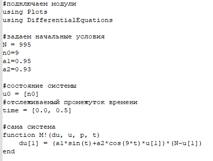

:::
::: {.column width="50%"}

Код на OpenModelica

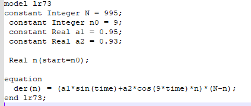
:::
::::::::::::::

## Результаты для третьего случая

:::::::::::::: {.columns align=center}
::: {.column width="50%"}

Из Julia
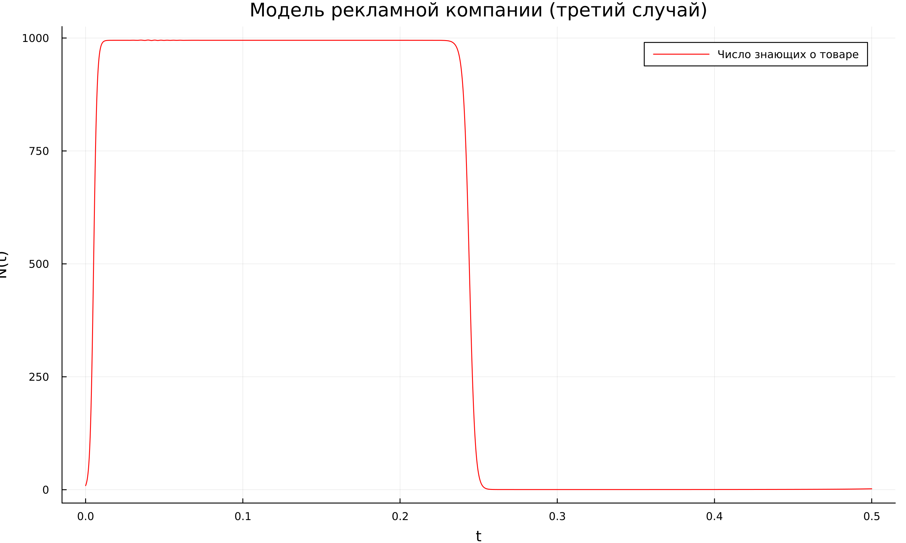

:::
::: {.column width="50%"}

Из OpenModelica
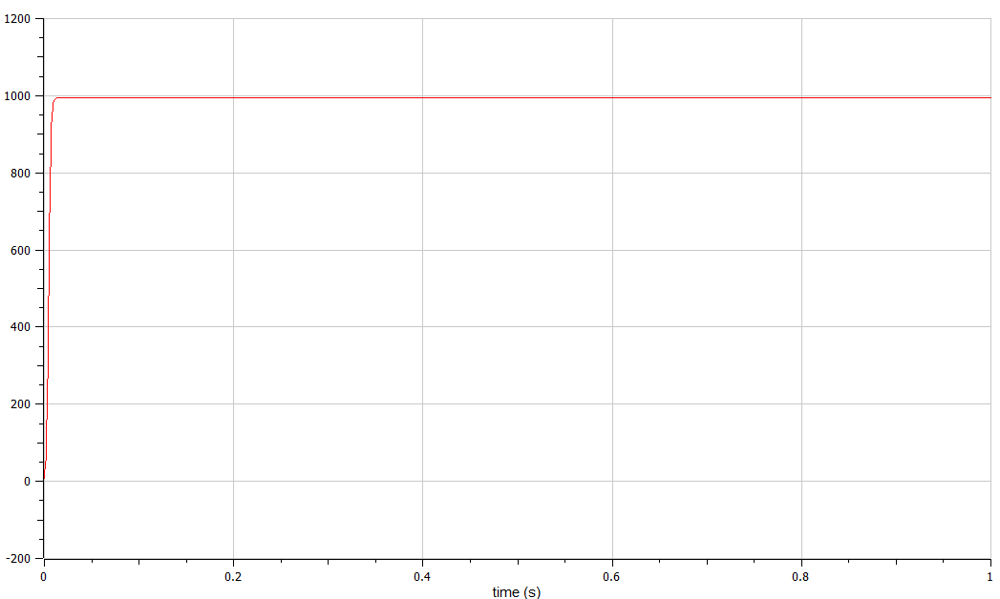
:::
::::::::::::::

# Результаты

## Результат

Построены график распространения рекламы, математическая модель которой описывается следующим уравнением: 

1. $\frac{dn}{dt}=(0.95+0.0008n(t))(N-n(t))$

2. $\frac{dn}{dt}=(0.000095+0.92n(t))(N-n(t))$

2. $\frac{dn}{dt}=(0.95\sin(t)+0.93\cos(9t)n(t))(N-n(t))$

Для случая 2 определено в какой момент времени скорость распространения рекламы будет
иметь максимальное значение - 0.

# Вывод

## Вывод

Я рассмотрела модель рекламной компании. Выполнила задание согласно варианту: построила график распространения рекламы, математическая модель которой описывается заданным уравнением (три случая), определила в какой момент времени скорость распространения рекламы будет иметь максимальное значение.