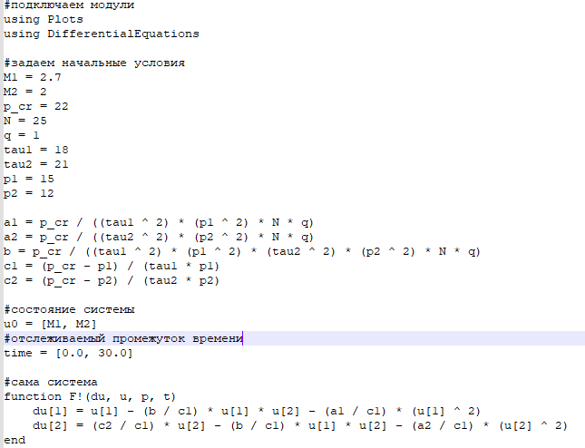
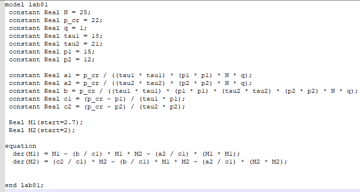
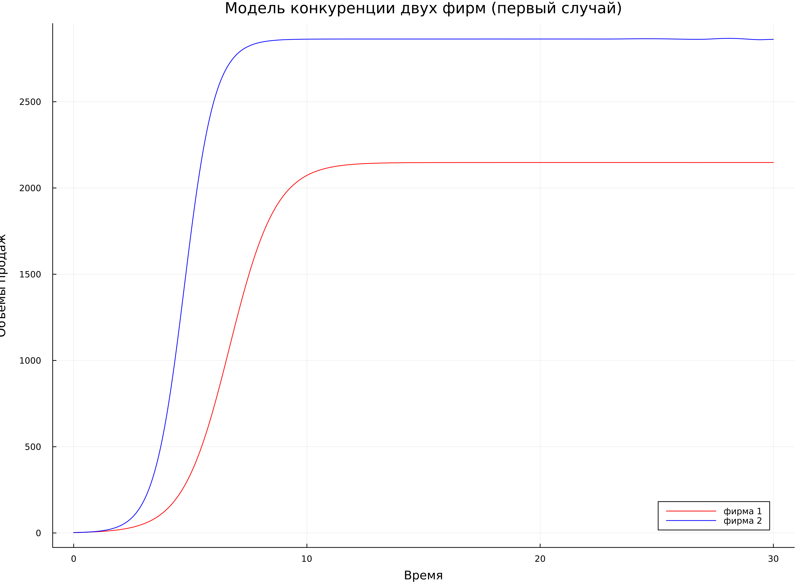
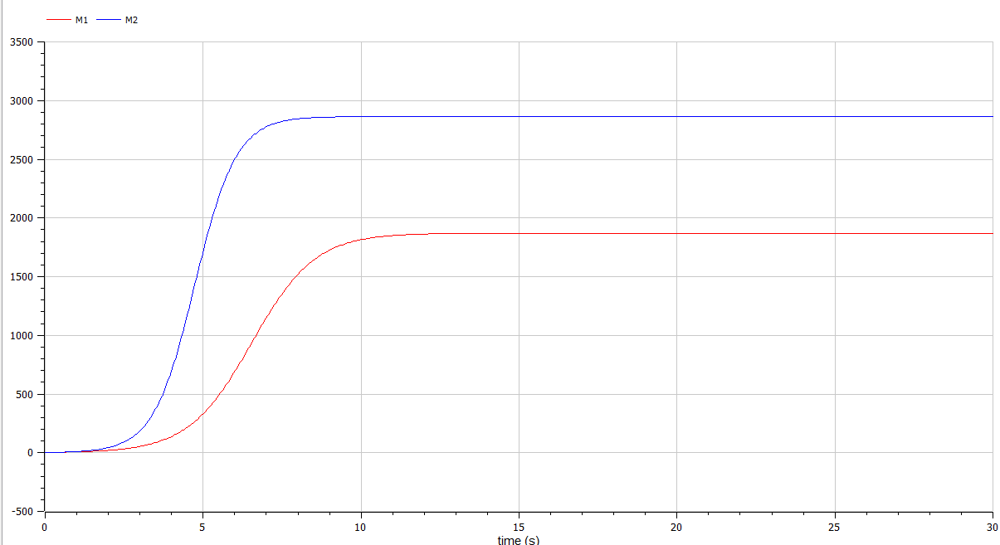
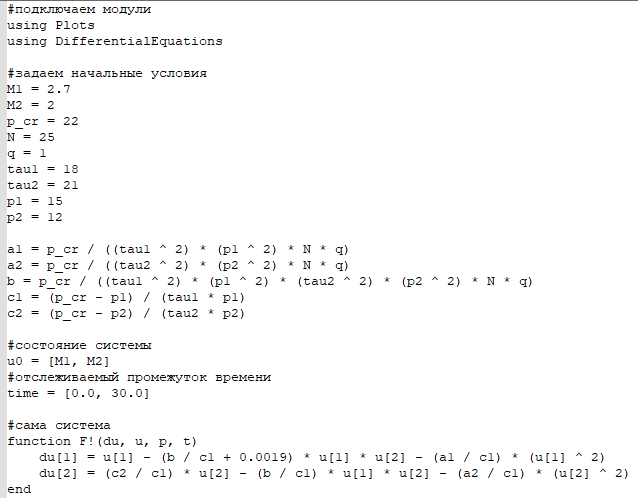
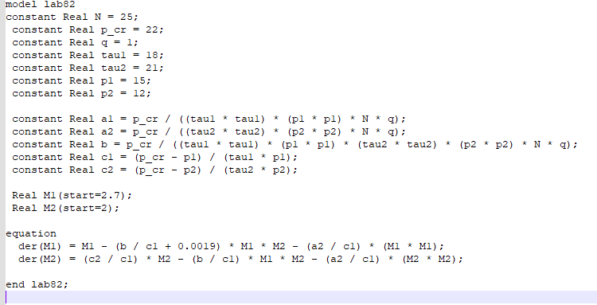
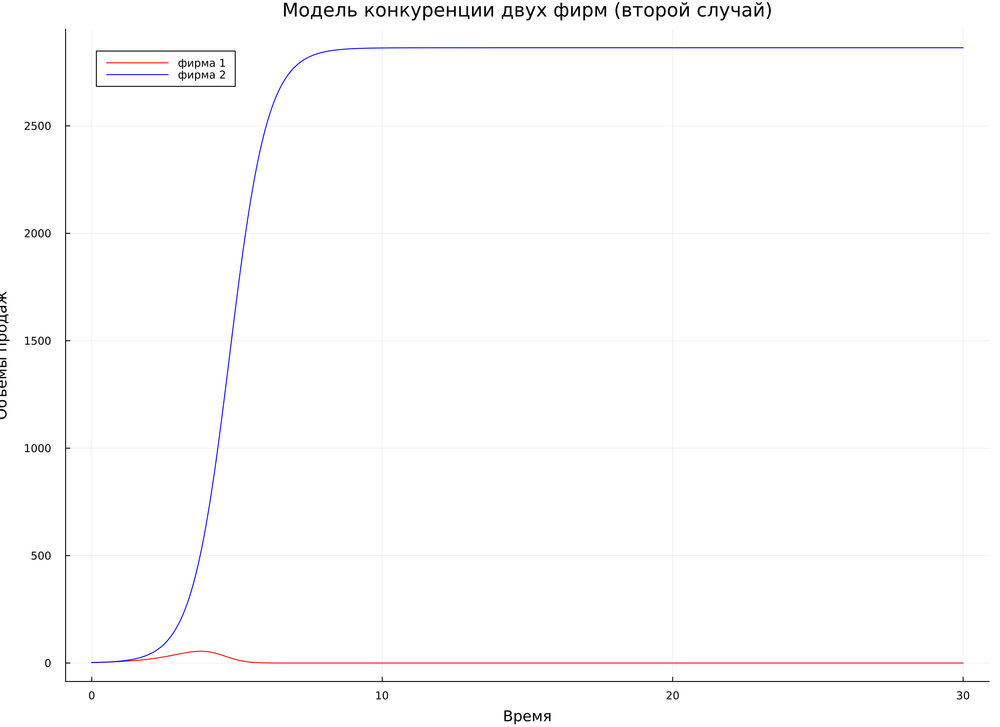
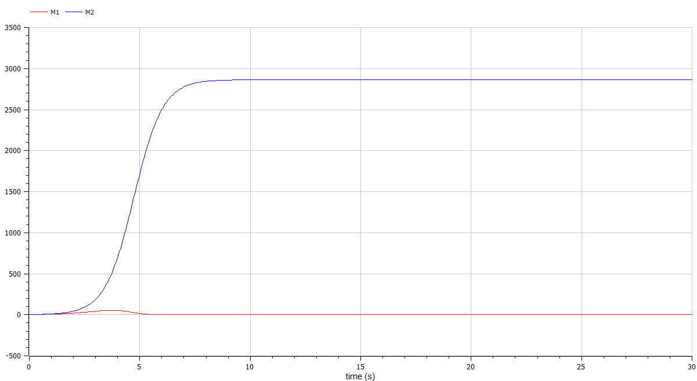

---
## Front matter
lang: ru-RU
title: Лабораторная работа №8
subtitle: Модель конкуренции двух фирм
author:
  - Афтаева К.В.
institute:
  - Российский университет дружбы народов им. Патриса Лумумбы, Москва, Россия
date: 1 апреля 2023

## i18n babel
babel-lang: russian
babel-otherlangs: english

## Formatting pdf
toc: false
toc-title: Содержание
slide_level: 2
aspectratio: 169
section-titles: true
theme: metropolis
header-includes:
 - \metroset{progressbar=frametitle,sectionpage=progressbar,numbering=fraction}
 - '\makeatletter'
 - '\beamer@ignorenonframefalse'
 - '\makeatother'
---

# Информация

## Докладчик

:::::::::::::: {.columns align=center}
::: {.column width="70%"}

  * Афтаева Ксения Васильевна
  * студент группы НПИбд-01-20
  * Российский университет дружбы народов им. Патриса Лумумбы
  * [1032201739@pfur.ru](mailto:1032201739@pfur.ru)
  * <https:https://github.com/KVAftaeva>

:::
::: {.column width="30%"}

:::
::::::::::::::

# Вводная часть

## Актуальность

- Необходим навык математического моделирования, которое является неизбежной составляющей научно-технического прогресса

## Объект и предмет исследования

- Модель конкуренции двух фирм
- Julia
- OpenModelica

## Цели и задачи

Рассмотреть модель конкуренции двух фирм. Выполнить задание согласно варианту: построить графики изменения оборотных средств фирмы 1 и фирмы 2 без
учета постоянных издержек и с веденной нормировкой для двух случаев.

## Материалы и методы

- Julia
- OpenModelica

# Выполнение работы

## Первый случай

Рассмотреть две фирмы, производящие взаимозаменяемые товары одинакового качества и находящиеся в одной рыночной нише. Считаем, что в рамках нашей модели конкурентная борьба ведётся только рыночными методами. 

 В этом случае динамика изменения объемов продаж фирмы 1 и фирмы 2 описывается следующей системой уравнений:

$$\frac{dM_1}{d\Theta} = M_1 - \frac{b}{c_1}M_1 M_2 - \frac{a1}{c1} M_1^2 $$

$$\frac{dM_2}{d\Theta} = \frac{c_2}{c_1} M_2 - \frac{b}{c_1} M_1 M_2 - \frac{a_2}{c_1} M_2^2$$

## Написание кода для первого случая
:::::::::::::: {.columns align=center}
::: {.column width="50%"}
Фрагмент кода на Julia

:::
::: {.column width="50%"}

Код на OpenModelica

:::
::::::::::::::

## Результаты для первого случая

:::::::::::::: {.columns align=center}
::: {.column width="50%"}

Из Julia

:::
::: {.column width="50%"}

Из OpenModelica

:::
::::::::::::::

## Второй случай

Рассмотреть модель, когда, помимо экономического фактора влияния (изменение себестоимости, производственного цикла, использование кредита и т.п.), используются еще и социально-психологические факторы – формирование общественного предпочтения одного товара другому, не зависимо от их качества и цены. 

 Пусть в рамках рассматриваемой модели динамика изменения объемов продаж фирмы 1 и фирмы 2 описывается следующей системой уравнений:

$$\frac{dM_1}{d\Theta} = M_1 - (\frac{b}{c_1} + 0.0019)M_1 M_2 - \frac{a1}{c1} M_1^2$$

$$\frac{dM_2}{d\Theta} = \frac{c_2}{c_1} M_2 - \frac{b}{c_1} M_1 M_2 - \frac{a_2}{c_1} M_2^2$$

## Написание кода для второго случая
:::::::::::::: {.columns align=center}
::: {.column width="50%"}
Фрагмент кода на Julia

:::
::: {.column width="50%"}

Код на OpenModelica

:::
::::::::::::::

## Результаты для второго случая

:::::::::::::: {.columns align=center}
::: {.column width="50%"}

Из Julia

:::
::: {.column width="50%"}

Из OpenModelica

:::
::::::::::::::

# Результаты

## Результат

Построены графики изменения оборотных средств фирмы 1 и фирмы 2 без
учета постоянных издержек и с веденной нормировкой для двух случаев.

# Вывод

## Вывод

Я рассмотрела модель конкуренции двух фирм. Выполнила задание согласно варианту: построила графики изменения оборотных средств фирмы 1 и фирмы 2 без
учета постоянных издержек и с веденной нормировкой для двух случаев.